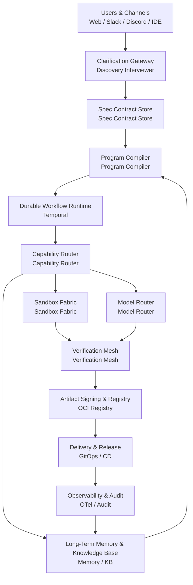
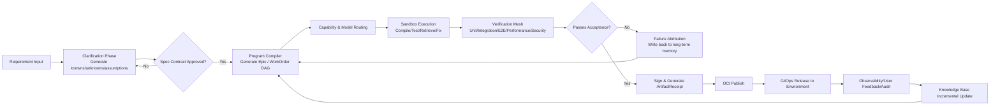
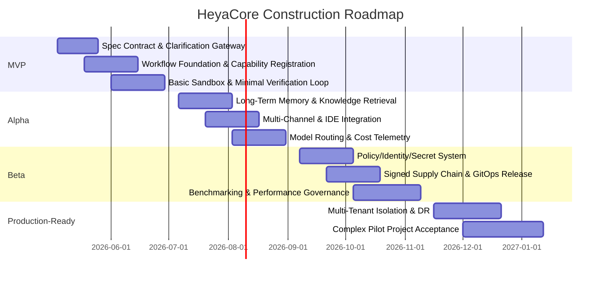

# HeyaCore Component-Based AI Application Architecture Implementation Plan

## Executive Summary

HeyaCore should not be designed as a "chatting agent shell," but rather as an **AI software factory centered on workflows, bounded by typed contracts, and delivering verifiable artifacts.** The rationale is straightforward: the stated goal is not to generate demos, but to support complex engineering projects such as "developing an entirely new game engine from scratch" -- long-cycle, highly coupled, strongly verified, and rollback-capable. The accompanying "The Heya User Manifesto" also explicitly requires the system to "ask before building," "never guess," "propose better solutions," "actually deliver," "be reachable everywhere," "remember everything," and "match 100-point input." This determines that HeyaCore must make **clarification, planning, execution, verification, audit, and rollback** a complete product and engineering chain, rather than leaving these steps for manual patching.

Therefore, the recommended approach in this document is: use **Temporal** as the durable execution foundation for long-running tasks and fault recovery; use **gRPC + Protobuf** for internal strongly-typed RPC; use **NATS JetStream** as the default control event bus; use **PostgreSQL + pgvector + OpenSearch + object storage** for project memory and knowledge base; use **Firecracker / gVisor / WASI** for layered sandbox execution; use **OpenFGA + OPA + Vault + SPIRE** for authorization, policy, secrets, and workload identity; use **OpenTelemetry + Prometheus + Grafana** for full-chain observability; and use **Bazel + SLSA + Sigstore + Argo CD** to ensure reproducible builds, trusted supply chains, and auditable delivery. The model layer adopts **multi-provider routing**: using frontier closed-source models for high-risk planning and code review, using OpenAI-compatible / OpenAI-Responses-compatible interfaces as the unified abstraction, and using China-region/private-deployment models and vLLM/KServe local services as alternatives and fallbacks.

If this architecture is implemented as a platform, I recommend starting with a **cloud-first MVP** that completes the shortest closed loop of "clarification -> spec contract -> task DAG -> sandbox execution -> automated verification -> artifact signing -> GitOps release" within 8-10 weeks; then spending 4-6 months to complete long-term memory, multi-channel access, policy governance, cost control, and multi-model routing; and finally using a high-complexity pilot such as a "rendering subsystem" to validate the platform's ability to support truly complex projects. Labor costs are **unspecified** due to regional, employment structure, and organizational level differences; therefore, this document provides **person-month estimates + runtime cost formulas + differentiated recommendations for three deployment models**, rather than pseudo-precise fixed prices.

## Requirements Baseline and Objectives

The original problem statement notes "attached user experience details not provided -- assumed unspecified," but the current session actually includes "The Heya User Manifesto." This document is not a pixel-level specification but a higher-level **experience contract**: the system must clarify first, prohibit blind guessing, proactively propose better solutions, support actual delivery, exist across channels, maintain persistent memory, and align with user input depth rather than output "good enough" results. Therefore, this document treats the Manifesto as **the valid UX principle source for HeyaCore**; however, finer-grained interface layout, response timing, notification strategy, budget caps, deployment boundaries, and SLA values remain treated as "unspecified."

| Manifesto Requirement | Corresponding Architecture Mechanism | Direct Implementation |
|---|---|---|
| Ask before building | Clarification Gateway | First turn does not execute directly but generates a `SpecContract` recording knowns, unknowns, assumptions, risks, and acceptance criteria |
| Never guess | Assumption Ledger and Approval Gate | All "inferred items" must be explicitly tagged and await user or rule approval |
| Propose better solutions | Dual-Track Planner | Each planning pass simultaneously outputs "implement as requested" and "superior alternative" |
| Actually deliver | Executable Delivery Pipeline | Tasks must enter sandbox execution, testing, signing, and release -- not stop at text suggestions |
| Reachable everywhere | Omnichannel Gateway | Unified access from Slack, Discord, IDE, and Web |
| Remember everything | Layered Long-Term Memory | Conversation memory, project memory, artifact lineage, decision logs, knowledge retrieval |
| Match 100-point input | Quality Budget Policy | High-risk/high-value tasks automatically increase review rounds, test coverage, and benchmark constraints |
| Overcome AI nature | Anti-Shortcut Governance | Mandatory clarification, mandatory verification, mandatory evidence, mandatory rollback paths |

These mappings come directly from the experience commitments in the attached document, not retrofitted product "embellishments." If these mechanisms do not exist, HeyaCore will resemble an ordinary Agent framework rather than an engineering system for complex projects.

Below are the recommended architectural objectives and non-functional requirements. Where you have not explicitly specified, I have marked them as "unspecified" while providing **actionable recommended values** for direct project initiation and acceptance.

| Dimension | User Specified? | Recommended Target | Description |
|---|---|---|---|
| Scalability | Unspecified | Single cluster supports at least thousands of concurrent workflows; horizontal scaling of execution workers | Stateless control layer + scalable execution layer |
| Composability | Unspecified | All modules register via capability contracts; supports replacing models, tools, and storage | Unified `CapabilityManifest` |
| Performance | Unspecified | Interactive request first-response p95 < 2s; long tasks return progress handle within 3s | Distinguish "answer latency" from "task execution duration" |
| Latency | Unspecified | Execution tasks must stream status back; no "black-box waiting" | Necessary for complex project experience |
| Fault tolerance | Unspecified | Worker crashes do not lose state; idempotent retries; human-recoverable | Depends on durable workflows and event history |
| Security | Unspecified | Zero trust by default; untrusted code must run in sandbox; short-lived secrets | Models must not obtain long-lived static secrets |
| Observability | Unspecified | Every WorkOrder, tool call, model call, and release action traceable and auditable | Trace/Metric/Log/Artifact consistently correlated |
| Developer experience | Unspecified | New modules scaffoldable, registrable, testable, and replayable within 30 minutes | Strong dependency on templates, contracts, and local replay |
| Cost estimation | Unspecified | Establish five cost models: token, compute, storage, testing, and labor | Currency budget cap still unspecified |
| Deployment environment | Unspecified | Provide cloud, local, and hybrid reference topologies simultaneously | See deployment recommendations below |

These objectives are reasonable because long-running workflows require resumable state and event history, internal services need strongly-typed interfaces, module capabilities need to be discoverable, observability needs unified semantics, policies and authorization need to be codified, and the delivery chain must be declarable, rollbackable, and auditable.

## Overall Architecture and Key Design Decisions

HeyaCore's core design is not "multi-agent collaboration" itself, but decomposing complex engineering into five planes: **intent plane, control plane, capability plane, data plane, and trust & operations plane.** The intent plane converges vague natural language into executable contracts; the control plane handles long-running task orchestration, state machines, approvals, and recovery; the capability plane provides unified abstraction for tools, modules, and models; the data plane manages long-term memory, version lineage, and artifact storage; the trust & operations plane handles identity, permissions, policies, observability, supply chain, and release. In other words, chat is merely the entry point; the true product kernel is a **workflow system with memory.**

Technically, the four most important decisions are as follows. First, **workflows as the system's source of truth**: Temporal's workflow execution is durable, capable of recovering to pre-failure state after application crashes or infrastructure failures, with replayable event history -- a characteristic naturally suited to month-long engineering projects that will be repeatedly paused, resumed, and rolled back. Second, **contracts as module boundaries**: external HTTP uses OpenAPI, internal RPC uses gRPC/Protobuf, tool interfaces are compatible with MCP, but all converge first into HeyaCore's own `CapabilityManifest`. Third, **verifiable artifacts rather than text as delivery units**: modules, images, and generated artifacts are uniformly distributed via OCI and content-addressed; releases must be accompanied by test reports and signatures. Fourth, **models as capability providers, not the system brain**: OpenAI, Anthropic, Gemini, Qwen, DeepSeek, Kimi, and GLM are all connected via the router; the platform must not be locked into any single model SDK.



The key implication of this diagram is: **every important action must leave structured traces in the system.** WorkOrders, approvals, model calls, tool calls, test results, build artifacts, deployment versions, and audit logs are all correlated with the same `trace_id` / `workflow_id` / `artifact_digest`. OpenTelemetry's semantic conventions and Collector handle unified telemetry ingestion; Prometheus handles time-series metrics and alerting; Grafana handles dashboards and cross-metric/log/trace correlation.

At the workflow subgraph level, LangGraph or Semantic Kernel can serve as **"reasoning sub-orchestrators" within workflows**, particularly suitable for multi-agent subgraphs, checkpoints, and tool orchestration; however, they should not replace the durable workflow foundation. LangGraph's persistent execution allows resumption after interruption and continuation from checkpoints; Semantic Kernel emphasizes model-agnostic enterprise-grade middleware capabilities; by contrast, the official AutoGen repository has explicitly marked itself as maintenance mode and recommends new users migrate to successor frameworks, making it unsuitable as HeyaCore's long-term foundation.

## Core Components and Interfaces

The table below presents HeyaCore's core components, responsibilities, interfaces, protocols, and recommended implementations. To make this directly actionable, I have abstracted interfaces to the granularity of "you can start defining OpenAPI / proto / event schemas today," rather than stopping at concept diagrams.

| Component | Primary Responsibility | Core Interfaces | Default Protocol | Data Format | Recommended Implementation |
|---|---|---|---|---|---|
| Clarification Gateway | Convert vague requirements into structured spec contracts | `CreateSpecContract`, `ResolveAmbiguity` | HTTPS + SSE | JSON | Web/API Gateway + Rules Engine |
| Spec Contract Store | Store knowns/unknowns/assumptions/acceptance criteria | `GetContract`, `ApproveContract` | gRPC | Protobuf | PostgreSQL |
| Program Compiler | Compile contracts into Epic / Task / WorkOrder DAGs | `CompileProgram`, `ReplanFromFailure` | gRPC | Protobuf | HeyaCore Planner Worker |
| Module Registration & Discovery | Register capabilities, ownership, versions, risk levels | `RegisterCapability`, `SearchCapabilities` | gRPC + REST | JSON/Proto | Backstage Catalog + Registry API |
| Capability Abstraction Layer | Unify OpenAPI, gRPC, MCP, CLI, Human Task | `InvokeCapability` | gRPC / HTTP / MCP Broker | JSON / Protobuf | Capability Router |
| Version & Dependency Management | Dependency resolution, artifact lineage, semantic versioning, rollback | `ResolveDependencyGraph`, `GetArtifactLineage` | gRPC | Protobuf | OCI Registry + Metadata DB |
| Workflow Runtime | Long-running tasks, approvals, recovery, timeouts, compensation | `StartWorkflow`, `SignalWorkflow`, `QueryWorkflow` | SDK / gRPC | Protobuf | Temporal |
| Model Management | Model metadata, rate limits, price cards, routing rules | `SelectModel`, `EstimateCost` | gRPC | Protobuf | Model Router Service |
| Reasoning Orchestration | Manage reasoning, tool-use, review, self-check | `RunReasoningSession` | gRPC + streaming | Proto/JSON | Router Worker + LangGraph/SK subgraph |
| Sandbox Execution Environment | Compile, test, run benchmarks, browser/CLI operations | `RunSandboxJob`, `StreamJobLogs` | gRPC + event stream | Protobuf / log stream | Firecracker + gVisor + WASI |
| Data & State Management | Project state, conversations, knowledge, indexes, cache | `WriteMemory`, `SearchMemory`, `GetProjectState` | gRPC / SQL | JSON / vector / blobs | Postgres + pgvector + OpenSearch + MinIO + Redis |
| Verification Mesh | Unit, integration, E2E, performance, security, benchmarks | `RunVerificationSuite`, `PublishScorecard` | gRPC + async event | JSON/Proto | Bazel + Playwright + custom benches |
| CI/CD & Release | Build, sign, policy check, release, rollback | `BuildArtifact`, `PromoteRelease`, `RollbackRelease` | GitOps / gRPC / events | OCI / YAML / JSON | Bazel + Sigstore + Argo CD |
| UI/UX Integration Points | Web, Slack, Discord, VS Code, JetBrains | `PostStatus`, `OpenReviewPanel` | HTTPS/Webhook/WebSocket | JSON | Channel Adapters |
| Permissions & Audit | Fine-grained authorization, policy, secrets, audit ledger | `CheckAccess`, `IssueEphemeralSecret`, `AppendAudit` | gRPC / policy query | JSON / tuples | OpenFGA + OPA + Vault + SPIRE |

The selection rationale for this table is: Backstage is suitable for software catalog and ownership discovery; OpenAPI is suitable for machine-discoverable descriptions of open HTTP APIs; gRPC uses HTTP/2 and is naturally suited for internal strongly-typed RPC; NATS request-reply and JetStream balance low latency with message persistence; Temporal provides durable execution; OCI defines standard image/content distribution; Firecracker, gVisor, and WASI cover micro-VM, container isolation, and lightweight Wasm tool execution respectively; PostgreSQL, pgvector, OpenSearch, S3-compatible object stores, and Redis correspond to transactions, vectors, search, objects, and hot caching; OpenFGA/OPA/Vault/SPIRE handle authorization, policy, secrets, and workload identity respectively.

Below are four interface definitions recommended as the platform's "atomic objects." All subsequent services work around these four objects, and system complexity will decrease significantly.

```yaml
# CapabilityManifest
apiVersion: heyacore.io/v1alpha1
kind: Capability
metadata:
  name: cpp.build.module
  version: 1.3.0
  owner: engine-platform
spec:
  executionClass: sandbox
  transport:
    kind: grpc
    endpoint: dns:///builder.engine.svc:7443
  inputSchemaRef: oci://registry.heya.local/schemas/cpp.build.request:1.0.0
  outputSchemaRef: oci://registry.heya.local/schemas/cpp.build.result:1.0.0
  auth:
    scope: capability.invoke.cpp.build
    riskClass: high
  limits:
    timeoutSeconds: 1800
    maxConcurrency: 20
  observability:
    emits:
      - build.started.v1
      - build.finished.v1
      - build.failed.v1
```

```json
{
  "kind": "WorkOrder",
  "version": "v1",
  "workorder_id": "wo_rendergraph_2026_00017",
  "project_id": "game_engine_alpha",
  "parent_id": "epic_rendering_pipeline",
  "goal": "Implement RenderGraph compiler prototype and pass 12 golden scene regression tests",
  "inputs": {
    "repo_ref": "git+ssh://git.heya/game-engine.git#refs/heads/rendergraph",
    "contract_ref": "spec://game_engine_alpha/rendering/v3",
    "acceptance_criteria": [
      "graph_compiler_tests == pass",
      "golden_scene_regression_delta <= 0.1%",
      "p95_compile_latency_ms < 50"
    ]
  },
  "required_capabilities": [
    "repo.checkout",
    "cpp.build.module",
    "test.run",
    "benchmark.run",
    "artifact.publish"
  ],
  "risk_class": "high",
  "approval_policy": "human_required_before_merge"
}
```

```json
{
  "kind": "ArtifactReceipt",
  "version": "v1",
  "artifact_digest": "sha256:9d8f...",
  "source_commit": "3d4c9a1",
  "workflow_id": "wf_game_engine_rendering_392",
  "model_calls": [
    {"provider": "openai", "model": "gpt-5-family", "purpose": "review"},
    {"provider": "deepseek", "model": "deepseek-v4-pro", "purpose": "patch_synthesis"}
  ],
  "verification": {
    "unit": "pass",
    "integration": "pass",
    "e2e": "pass",
    "perf": "warn"
  },
  "signature": {
    "method": "sigstore-cosign",
    "bundle_ref": "oci://registry.heya.local/attestations/rendergraph@sha256:9d8f..."
  }
}
```

```proto
service PlannerService {
  rpc CompileProgram(CompileProgramRequest) returns (CompileProgramResponse);
  rpc ReplanFromFailure(ReplanFromFailureRequest) returns (CompileProgramResponse);
  rpc ExplainPlan(ExplainPlanRequest) returns (PlanExplanation);
}

message CompileProgramRequest {
  string project_id = 1;
  string contract_ref = 2;
  repeated string available_capabilities = 3;
  string planning_policy = 4; // strict, balanced, aggressive
}
```

The standardization thinking behind these interface styles is consistent with OpenAPI's "machine-understandable API description," gRPC's HTTP/2 protocol mapping, MCP's standardized tool/context connection approach, and OCI's content distribution and content addressing.

To provide a clearer "open-source vs. commercial" comparison for technology selection, I recommend the following matrix.

| Category | Open-Source Candidates | Commercial/Managed Candidates | Recommendation | Rationale |
|---|---|---|---|---|
| Long-running orchestration | Temporal OSS, LangGraph, Semantic Kernel | Temporal Cloud | **Temporal as foundation; LangGraph/SK as subgraph layers** | Requires year-level durable execution and recovery; subgraphs only handle local reasoning |
| Event bus | NATS JetStream, Kafka | Confluent Cloud | **NATS JetStream default; Kafka only for ultra-high-throughput scenarios** | Control plane needs low latency and easy operations; add Kafka for analytics later |
| Service interfaces | gRPC, REST/OpenAPI | API Gateway / Service Mesh | **Internal gRPC, external REST + SSE** | Internal needs strong typing; external needs ecosystem compatibility |
| Model serving | vLLM, KServe | OpenAI / Anthropic / Gemini / Cloud Model APIs | **Multi-provider API + local vLLM/KServe fallback** | Fast first, stable later; API first, then localize |
| Storage & memory | PostgreSQL, pgvector, OpenSearch, MinIO, Redis | Managed Postgres / OpenSearch / Elastic Cloud | **Postgres as source of truth, OpenSearch for retrieval, MinIO for artifacts, Redis for hot cache** | Reduce state fragmentation while preserving extensibility |
| Catalog & discovery | Backstage + OCI Registry | Commercial developer portals | **Backstage + OCI** | Component discovery, ownership, and artifact distribution all standardizable |
| Sandbox | Firecracker, gVisor, WASI | Proprietary code execution platforms | **Three-layer isolation combination** | Complex engineering requires different security/performance tradeoff levels |
| Security governance | OpenFGA, OPA, Vault, SPIRE, cert-manager | Cloud IAM / KMS / Secret Manager | **Platform-agnostic control plane + cloud vendor adaptation layer** | Ensures consistency across cloud, local, and hybrid |
| Supply chain & release | Bazel, Sigstore, Argo CD, SLSA | Commercial DevSecOps suites | **Bazel + Sigstore + Argo CD** | Reproducible builds, signing, and GitOps rollback chain are clearest |

The basis for this selection matrix comes from Temporal's durable execution and Cloud options, LangGraph's persistent execution, Semantic Kernel's model-agnostic middleware, AutoGen's maintenance mode, NATS JetStream's message storage and replay, Kafka's exactly-once semantics, vLLM's OpenAI-compatible server, KServe's OpenAI spec support, Backstage software catalog, OCI specification, OpenFGA/Zanzibar, OPA, Vault, SPIRE, cert-manager, Bazel, SLSA, Sigstore, and Argo CD's official documentation.

## Long-Term Complex Project Workflow and Collaboration

The key to HeyaCore for "complex long-term projects" is not having a single Agent autonomously write code all the way through, but decomposing complex engineering into five parallel threads: **layered task decomposition + long-term memory + parallel collaboration + automated verification + rollbackable delivery.** In practice, I recommend decomposing tasks into four layers: `Program` (e.g., "entirely new game engine") -> `Epic` (rendering, physics, resource system, editor) -> `WorkOrder` (completable and verifiable engineering slices within 3 days) -> `Operation` (specific tool actions). This ensures plans are long enough, execution is fine-grained enough, and failures are recoverable enough.

Long-term memory is recommended in three categories. **Episodic memory** stores sessions, annotations, approvals, and failure post-mortems; **semantic memory** stores knowledge cards, source code summaries, design patterns, interface descriptions, and retrieval indexes; **procedural memory** stores reusable process templates for "how to do something," such as "create a new subsystem," "refactor a module," "do performance regression," or "release a preview environment." PostgreSQL handles strong-transaction metadata and JSON documents; pgvector puts memory and documents into the same transaction system for similarity retrieval; OpenSearch handles large-scale full-text/vector hybrid search; object storage holds large files, build artifacts, screen recordings, benchmark reports, and golden samples.

Rollback and version control should not rely solely on Git. Git handles source code history, OCI digest handles artifact identity, Temporal event history handles execution process recovery, Argo CD handles environment-level desired-state rollback, and Sigstore with SLSA handles "was this artifact truly produced by that build." If only code is rolled back without rolling back artifacts, policies, and verification results, complex projects will quickly lose accountability.

Parallel development is recommended using a **"one WorkOrder, one isolated workspace"** model. Each `WorkOrder` has its own branch, sandbox, and verification context; the Planner decides which tasks can run in parallel based on `ownership zone`, dependency DAG, and conflict prediction. Component ownership and metadata are managed by the Backstage Catalog, and execution results are written back to a unified lineage graph. If two WorkOrders modify the same module, the system does not let the model blindly merge but creates a `MergeCoordinationWorkflow` that first runs a semantic diff, then compilation and regression testing, and finally enters a human approval gate.

Automated verification and benchmark testing is the watershed that distinguishes HeyaCore from "ordinary multi-agent orchestration." The build side needs a reproducible/sandboxable build system like Bazel; the frontend/editor side needs Playwright for end-to-end regression; Agent capabilities themselves should be continuously evaluated using SWE-bench Verified / SWE-bench-Live for real software engineering task capability, and HumanEval for lightweight code generation regression. For graphics and real-time systems like "game engines," project-private benchmarks must also be added, such as rendering golden scenes, physics stability, resource load time, editor interaction latency, and cross-platform build success rate.



This pipeline simultaneously satisfies several key Manifesto requirements: clarify before starting, don't guess during execution, output artifacts not text, failures leave post-mortems and memory, and the system continuously improves through history and feedback.

## Deployment Recommendations and Implementation Roadmap

Since the target deployment environment is **unspecified**, the most prudent approach is not to bet on one deployment model but to design three reference topologies from the start: **cloud-first, local-first, and hybrid deployment.** The biggest difference between the three models is not "whether it can run" but in **data sovereignty, model scheduling, operational complexity, and cost structure.** Components like Kafka, Temporal, OpenSearch, object storage, and Kubernetes all support both self-hosted and various managed options; therefore, HeyaCore's control plane must be platform-agnostic.

| Deployment Model | Recommended Approach | Applicable Scenarios | Advantages | Trade-offs |
|---|---|---|---|---|
| Cloud-first | Managed K8s / managed Postgres / managed search / external model APIs; Temporal Cloud for workflows | MVP, rapid iteration, small teams | Fast launch, low operational burden, best for product validation first | High variable costs, data boundaries depend on cloud policies |
| Local-first | Self-hosted K8s, Temporal, self-hosted object/search/authorization; models mostly self-hosted via vLLM/KServe | Strong compliance, offline, high sovereignty requirements | Data and execution boundaries controllable, suitable for private assets | High upfront CAPEX and platform operations cost |
| Hybrid | Control/collaboration plane on cloud; sensitive code, knowledge, and execution plane on-premises; external models via desensitization proxy | Medium-to-large organizations needing both efficiency and compliance | Balances frontier model capabilities with sensitive data control | Most complex architecture, highest network and audit requirements |

These three recommendations are based on the facts that Kubernetes adapts to cloud/local, Temporal supports both self-hosted and Cloud, OpenSearch/Elastic supports both managed and self-hosted, vLLM/KServe is suitable for local model serving, and multiple model APIs support standardized interfaces.

For the implementation roadmap, I recommend dividing platform construction into four phases, with the **first complex engineering pilot** explicitly included as a milestone rather than waiting for the platform to be "fully complete" before finding a project to validate.

| Phase | Duration | Key Deliverables | Key Personnel | Person-Month Estimate |
|---|---|---|---|---|
| MVP | 8-10 weeks | Clarification gateway, spec contracts, workflow foundation, capability registration, basic sandbox, minimal verification mesh, ArtifactReceipt | 1 platform architect, 2 backend, 2 AI engineering, 1 infra, 1 QA | 18-24 |
| Alpha | +8-10 weeks | Long-term memory, knowledge retrieval, Backstage catalog, multi-channel access, model routing, cost telemetry, basic permissions | 2 backend, 2 AI engineering, 2 infra/SRE, 1 frontend/IDE, 1 QA | 20-26 |
| Beta | +10-12 weeks | Policy engine, workload identity, supply chain signing, canary release, rollback, performance benchmarks, private model path | 1 platform architect, 1 security, 2 infra, 2 AI engineering, 2 QA/bench | 24-30 |
| Production-ready | +10-12 weeks | Multi-tenant isolation, audit ledger, disaster recovery, SLO dashboards, pilot project acceptance package | 1 architect, 2 SRE, 1 security, 2 AI engineering, 1 product/design, 2 QA | 24-30 |

Estimated by platform construction alone, **v1.0 requires approximately 70-95 person-months.** Since your budget, regional compensation, and organizational cost structure are unspecified, I will not convert this into a currency amount; however, this person-month scale roughly corresponds to an 8-10 person core team working continuously for 8-10 months. For a platform that can "truly support complex engineering," this scale is realistic rather than overly conservative.



In terms of organization and skills, the most easily underestimated roles are not Agent prompters but **platform engineering, SRE, testing/benchmarking, and security governance.** If you only staff "prompt engineers + two backend developers," you will most likely get a system that can demo but cannot be relied upon in production. For HeyaCore, platform architects, AI runtime engineers, backend/storage engineers, infra/SRE, security engineers, and QA/benchmark engineers are all indispensable.

## Risks, External Models, and Cost Model

Risks cannot be deferred until pre-launch. HeyaCore's failure modes are not "500 errors on interfaces" but discovering three weeks into a project that **the direction was wrong, memory is dirty, behavior is unauditable, models have regressed, sandboxes have escaped, or costs have spiraled.** The table below presents what I consider the most critical risks and countermeasures.

| Risk Type | Typical Risk | Impact | Mitigation Strategy |
|---|---|---|---|
| Technical | Planning drift, context contamination, long-task interruption | Project goes off track, massive rework | Spec contracts, staged approval gates, durable workflows, mandatory replanning after failure |
| Technical | Model regression or provider volatility | Sudden quality degradation | Model router version locking, A/B, replay evaluation, degradation strategies |
| Technical | Sandbox escape or unauthorized tool execution | Security incident | Firecracker/gVisor/WASI layered isolation + OPA + least privilege |
| Technical | Memory "getting dirtier over time" | Misleading retrieval, degraded decisions | Memory layering, TTL/archival, human annotation of high-value knowledge |
| Organizational | Team over-reliance on Agents | Quality debt, audit debt | Human approval gates for high-risk tasks; manage quality with scorecards, not subjective feelings |
| Organizational | Unclear ownership | Conflicts, blame-shifting | Backstage catalog explicitly defines owner, risk level, and dependency boundaries |
| Ethics/Compliance | Sensitive code or personal data sent externally | Data security and compliance risk | Desensitization proxy, hybrid deployment, local retrieval, local execution, provider whitelist |
| Ethics/Compliance | Generated code license or provenance unclear | Legal risk | ArtifactReceipt + audit + license check + pre-release gate |
| Financial | Token and execution costs invisible | Cost runaway | Cost telemetry, budget thresholds, model selection by task value tier, caching and batching |

These countermeasures are valid because workflows need durable recovery and event history, sandboxes need strong isolation, authorization needs relational models and policy engines, short-lived credentials are safer than static secrets, catalog-based ownership is a fundamental governance mechanism in platform engineering, and observability with signed supply chains are prerequisites for complex system auditability.

If HeyaCore needs to integrate external models or services, I recommend handling them in the following priority order. "Priority" here does not mean "who is smartest" but "greatest value for platform implementation." The core principle is only one: **models and tools must all be routed, metered, and replaceable.**

| Priority | Model/Service | Recommended Use | Selection Rationale | Alternatives |
|---|---|---|---|---|
| P0 | OpenAI GPT-5.x / Responses API | High-risk planning, complex code review, tool-heavy reasoning, multi-tool chains | Official guide positions GPT-5.5 for complex production workflows, coding, tool-intensive Agents, and long-context retrieval; Responses API supports stateful interaction, built-in tools, and function calling | Claude / Gemini |
| P0 | Claude Sonnet / Opus | Deep coding, refactoring, multi-round code review | Anthropic positions the Claude family as an advanced model family; Sonnet/Opus are specifically targeted at code and Agent scenarios | OpenAI / GLM-5 |
| P1 | Gemini 2.5 Pro | Ultra-long-context codebase analysis, multimodal document understanding, joint dataset/codebase reasoning | Official documentation states million-level context support with emphasis on code, math, STEM, and large codebase/document reasoning | OpenAI / Kimi |
| P1 | Qwen API | China-region access, standard protocol compatibility, cost optimization | Alibaba Cloud provides OpenAI Chat Completion, OpenAI Responses, and native interfaces simultaneously; low migration cost | DeepSeek / Kimi |
| P1 | DeepSeek API | OpenAI/Anthropic-compatible access, cost-sensitive tasks | Official documentation explicitly supports OpenAI/Anthropic-style interfaces, suitable for unified routing layer | Qwen / GLM |
| P1 | Kimi API | Long-range code writing, Agent tasks, Chinese scenarios | Moonshot emphasizes K2.6 for long-range code writing and Agents, with built-in tool ecosystem | Gemini / Qwen |
| P1 | GLM-5 | Agentic Engineering, domestic substitution, complex systems engineering | Zhipu positions GLM-5 as a foundation model for Agentic Engineering | Qwen / DeepSeek |
| P2 | vLLM + KServe | Local deployment, hybrid deployment, compliance scenarios, model fallback | vLLM supports OpenAI-compatible server; KServe supports OpenAI spec and autoscaling | Pure external API |

The basis for this priority table comes from OpenAI Responses and GPT-5.5 usage guides, Anthropic model and pricing pages, Gemini 2.5 Pro and long-context documentation, Alibaba Cloud Bailian Qwen API reference, DeepSeek API documentation, Moonshot official platform, Zhipu GLM-5 documentation, and vLLM/KServe official documentation.

Regarding costs, since you have not provided a budget cap, **the currency budget cap remains unspecified.** To keep the plan actionable, I recommend splitting HeyaCore's costs into five categories, all entering platform telemetry: **model token costs, sandbox execution costs, search/storage costs, observability costs, and labor costs.** Labor costs, being unspecified by region and organizational structure, should be managed in person-months; runtime costs should be calculated in real-time via formulas. The actionable estimation approach is as follows:

```text
Monthly Runtime Cost
= Sum(model input tokens x input unit price + output tokens x output unit price)
+ Sum(sandbox CPU/GPU hours x unit price)
+ Sum(object storage + search index + database capacity)
+ Sum(observability and log ingestion)
+ External tool/channel call fees
```

At the official level, OpenAI, Anthropic, Gemini, DeepSeek, Alibaba Cloud Bailian, and Moonshot all provide real-time model/pricing documentation, so the router should not hardcode prices into code but instead implement **hot-updatable provider price cards.** For the localized model path, vLLM and KServe allow decoupling "protocol compatibility" from "deployment location."

More practically: in **cloud-first** mode, the MVP phase is typically dominated by model/API costs and sandbox/CI costs; in **local-first** mode, upfront CAPEX and platform operations labor are the main costs; in **hybrid deployment**, network, audit, desensitization proxy, and dual-runtime governance costs are most easily underestimated. From a project initiation perspective, I recommend managing platform construction as **70-95 person-months + 6 months of runtime budget pool**, rather than pursuing "lowest single-month cost" from the start. For HeyaCore, **verifiable quality** matters more than "surface-level cheapness."

## Example: Building a Rendering Subsystem with HeyaCore

To demonstrate that this architecture is not theoretical, I use the **rendering subsystem** as a complete example. I chose it because it simultaneously presents several typical challenges: complex interfaces, cross-platform requirements, performance sensitivity, difficult regression testing, and tight coupling with resource systems/ECS/editor. Bevy's official documentation defines ECS as a decomposition pattern of Entity / Component / System, emphasizing its benefits for decoupling, memory access optimization, and parallelization; Godot's official documentation shows that modern engines support multiple renderer/driver combinations to adapt to different hardware and scenarios. For a "new game engine from scratch," both points are critical.

Within HeyaCore, I recommend decomposing the rendering subsystem itself into six modules: `SceneExtractor`, `RenderGraphCompiler`, `ResourceLifetimeManager`, `ShaderPipelineManager`, `BackendAdapter`, and `FrameTelemetryBridge`. These six modules are all exposed to the platform via capability registration, and the platform builds requirement contracts, development WorkOrders, test suites, and performance gates around them. In other words, HeyaCore does not "replace the renderer" but provides the long-term engineering foundation for the renderer's **design, coding, verification, regression, and deployment.**

| Module | Runtime Responsibility | HeyaCore Development Responsibility | Key Interface |
|---|---|---|---|
| SceneExtractor | Extract render views from ECS World | Generate/maintain extraction rules, dirty-region update logic, and tests | `ExtractRenderScene(world_delta)` |
| RenderGraphCompiler | Compile rendering intent into frame graphs | Maintain pass DAG, resource dependencies, barrier planning | `CompileFrameGraph(scene, frame_cfg)` |
| ResourceLifetimeManager | Texture/Buffer/Descriptor lifecycles | Leak detection, resource reuse, memory budget regression | `LeaseGpuResource(desc)` |
| ShaderPipelineManager | Shader compilation, caching, hot reload | Manage shader variants, cache keys, CI compilation matrix | `ResolvePipelineKey(material, pass)` |
| BackendAdapter | Vulkan / D3D12 / Metal / Compatibility | Manage backend adaptation layer and differential testing | `SubmitCompiledGraph(graph, backend)` |
| FrameTelemetryBridge | Feed frame-level metrics back to platform | Generate performance scorecards, regression alerts | `PublishFrameMetrics(frame_stats)` |

This decomposition borrows from ECS-driven data extraction patterns and multi-backend rendering thinking, but additionally introduces two engineering dimensions: "platform observability" and "verifiable resource lifecycle." This is typical HeyaCore style: not just running, but enabling long-term maintenance, regression, and iteration.

The recommended subsystem data flow is as follows.

```mermaid
flowchart LR
    W[ECS World] --> E[SceneExtractor]
    E --> S[RenderScene]
    S --> G[RenderGraphCompiler]
    G --> R[Compiled FrameGraph]
    R --> P[ShaderPipelineManager]
    P --> B[BackendAdapter]
    B --> GPU[GPU Driver]
    GPU --> T[FrameTelemetryBridge]
    T --> H[HeyaCore Verification Mesh]
    H --> K[Project Memory / Regression KB]
```



The most important implementation detail here is making the `RenderGraphCompiler` output a **snapshotable, comparable, replayable intermediate representation.** As long as the `Compiled FrameGraph` is serializable, HeyaCore can perform golden sample comparison, risk diff, failure replay, and artifact-lineage-based "tracing from a problem frame back to which plan / which change / which model suggestion." This is why I recommend all high-complexity subsystems design an "intermediate representation layer" rather than having the model directly write a bunch of backend API calls.

Below is a sample interface. It can be used both by the runtime and by HeyaCore's testing and benchmarking system.

```proto
message RenderScene {
  string scene_id = 1;
  repeated MeshInstance meshes = 2;
  repeated Light lights = 3;
  Camera camera = 4;
  FrameBudget budget = 5;
}

service RenderGraphService {
  rpc CompileFrameGraph(RenderScene) returns (CompiledFrameGraph);
  rpc ValidateFrameGraph(CompiledFrameGraph) returns (ValidationReport);
  rpc ExecuteFrameGraph(CompiledFrameGraph) returns (ExecutionReceipt);
}
```

```json
{
  "scene_id": "golden_city_block",
  "budget": {
    "cpu_frame_ms": 4.0,
    "gpu_frame_ms": 8.0,
    "vram_mb": 2048
  },
  "meshes": 1842,
  "lights": 127,
  "camera": {"projection": "perspective", "fov": 60}
}
```

For this rendering subsystem, I recommend HeyaCore establish at least the following test and performance thresholds during the pilot phase.

| Test Type | Use Case | Pass Criteria |
|---|---|---|
| Correctness | Same `RenderScene` input produces structurally identical frame graphs | Structure hash matches |
| Resource safety | No GPU resource leaks after 10,000 consecutive frames | Leak count = 0 |
| Regression | 12 golden scene screenshot differences | Pixel difference <= 0.1% |
| Backend consistency | Vulkan / D3D12 / Metal/Compatibility feature coverage matches | All core scenes pass |
| Performance | Scene compilation time | `CompileFrameGraph` p95 < 50ms |
| Frame budget | CPU/GPU frame budget on target hardware | CPU p95 < 4ms; GPU p95 < 8ms |
| Exception recovery | Device loss / shader invalidation / resource hot update | Auto-recovery or graceful degradation path |
| Developer experience | Incremental build and hot reload after shader modification | Incremental update time < 10s |

These thresholds are recommended values, not industry standards; but once written into `SpecContract` and `WorkOrder.acceptance_criteria`, HeyaCore can automatically generate verification, failure attribution, and release gates around them. This is the engineering implementation of "when the user gives 100-point requirements, the system must not deliver only 30 points": not through slogans, but through **turning high requirements into explicit, executable, auditable acceptance criteria.**

If this pilot is truly run in HeyaCore, I recommend generating the first batch of WorkOrders as follows: first, the clarification gateway confirms the target rendering path, target platform, and performance budget; then the program compiler generates six Epics: "ECS extraction layer," "frame graph IR," "shader pipeline cache," "backend adaptation," "golden scene regression," and "frame-level telemetry bridging"; each Epic is then sliced into WorkOrders completable and testable within three days; each WorkOrder executes in an isolated sandbox and generates an ArtifactReceipt; only when golden scenes, resource safety, and frame budgets all pass their thresholds can it be pushed to the pilot environment via GitOps. Only when this entire pipeline runs successfully can HeyaCore truly prove it can support "complex projects," not just demos.
