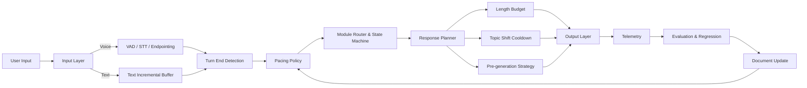
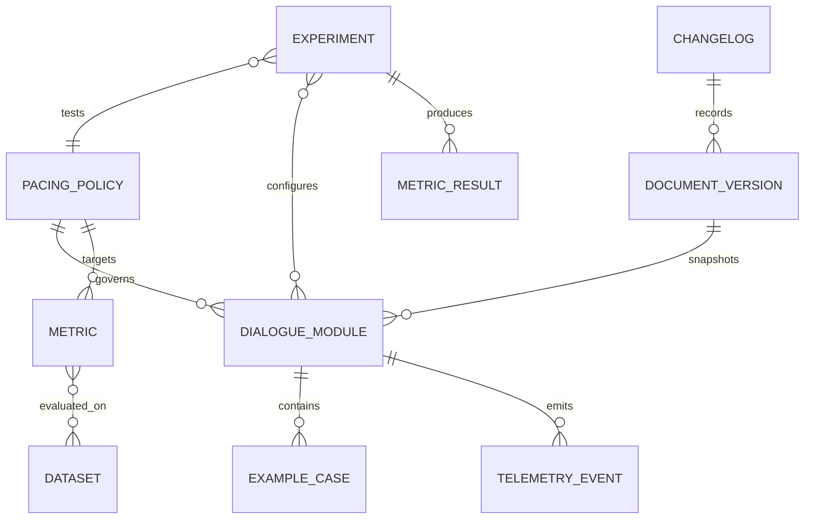

# Rhythm Control in Modular Dialogue Documents

## Executive Summary

This report defines "modular dialogue documents" as dialogue specification documents that use **flow / node / module / pattern / tool** as basic units, describing both business logic and explicitly recording runtime behavior. Over the past five years, mainstream systems have been progressively externalizing "rhythm" from an implicit experiential quality into a configurable, observable, and regression-testable parameter layer, including **turn detection, endpointing, interruptions, response latency, preemptive generation, segment length, topic shift, idle timeout, and context summarization.** The most typical engineering evidence comes from LiveKit's `TurnHandlingOptions`, OpenAI Realtime's `turn_detection`, Rasa's `Flows/Patterns`, Microsoft Adaptive Dialog's event/trigger mechanism, and Alibaba Cloud's real-time voice and agent parameters.

The most effective current approach is not "a single stronger model" but a **compositional rhythm control stack**: the bottom layer uses VAD / STT endpointing for timeliness, the middle layer uses semantic turn detectors or VAP/TurnGPT-type models to reduce false takeovers, the response layer uses preemptive generation and deferred TTS to start computing early without producing audio early, and the planning layer uses length budgets and topic shift cooldown times to control segment length and topic shift frequency. This compositional thinking appears simultaneously in academic work, official API documentation, and high-activity GitHub frameworks.

If the past five years of research and practice were compressed into a single sentence, the most critical change is: **from "how long is the silence before it counts as finished" to "has the user actually finished speaking."** OpenAI Realtime has distinguished `server_vad` and `semantic_vad` as two different modes; LiveKit's turn detector explicitly uses "conversational context + VAD"; AssemblyAI has directly named this class of methods semantic endpointing; VAP and response-conditioned / prompt-guided turn-taking further model "who speaks next, when, and for how long" as continuous prediction or conditional control problems.

From an evaluation perspective, the industry still lacks a unified, cross-scenario "rhythm overall score." The latest survey points out that **72% of turn-taking research has not been directly compared with existing methods**; Full-Duplex-Bench demonstrates that looking only at WER, BLEU, or task success rate is far from sufficient -- at minimum, four dimensions must be independently tested: **pause handling, backchanneling, smooth turn-taking, and interruption management.**

This report's core recommendation is: extract "rhythm" from prompts and upgrade it to a **PacingPolicy** as a first-class object in modular dialogue documents. Each module should explicitly declare: **entry conditions, maximum wait duration, minimum/maximum segment length, interruption strategy, false interruption recovery, topic shift cooldown time, summarization/truncation rules, observability metrics, and regression test cases.** Only then can true "reproducibility, iterative updating, and sustainable comparison" be achieved. This recommendation aligns with Rasa's separation of business flows / conversation patterns, Adaptive Dialog's event-driven model, and Pipecat/LiveKit's event and observer designs.

It should be noted that the user's request to "retrieve and read line-by-line all relevant resources from the past five years" cannot be strictly proven as exhaustive in an open internet environment. The conclusions below are based on **highly relevant primary sources explicitly retrieved and analyzed page-by-page/line-by-line in this session**; for a small number of GitHub PR file diffs that could not be fully rendered due to web rendering failures, this report employed a **cross-verification approach of PR/Issue summaries + adjacent code pages + official documentation** and marked evidence boundaries at relevant locations.

## Research Methodology and Evidence Boundaries

The evidence incorporated in this report covers three types of sources: first, academic papers and benchmarks from 2019-2026, prioritizing original publication pages from ACL, SIGDIAL, LREC-COLING, NAACL, EMNLP, COLING, and arXiv; second, official documentation and engineering blogs from OpenAI, LiveKit, Deepgram, AssemblyAI, Alibaba Cloud, Microsoft, and Rasa; third, GitHub official repositories, high-activity open-source repositories, and issues/PRs/release notes directly related to rhythm control. Chinese-language materials were prioritized for inclusion, but the primary research literature on this topic remains predominantly in English; high-quality Chinese primary materials mainly came from Microsoft Learn, Alibaba Cloud official documentation, and a small number of Chinese external pages.

The report decomposes "rhythm" into six operational sub-dimensions: **turn switching**, **response latency**, **segment length**, **topic shift frequency**, **interruption/yielding**, and **long conversation memory compression**. The first four are most densely represented in voice-agent frameworks and turn-taking papers over the past two years; the latter two appear more in topic-shift, length control, flows/patterns, and context summarization implementations.

One research boundary must be clarified upfront: **academic turn-taking literature predominantly targets two-person voice dialogue, while enterprise "modular dialogue documents" are more often text/task/tool-invocation systems.** Therefore, "voice endpoint detection" cannot be directly treated as the complete answer to "text dialogue rhythm." A more reliable approach is to elevate the mature **endpointing / interruption / latency** methods from voice research into universal pacing policies in module documents, while governing topic shift, response length, and summary truncation at the text and multi-turn task level.

## Method Overview and Comparison

The past five years can be divided into four main threads of rhythm control methods. The first is **rule-based endpoint detection based on silence or word boundaries.** Deepgram explicitly describes endpointing as "detecting a sufficiently long pause and returning `speech_final: true`," and recommends adjusting the threshold from the default to 300-500ms in conversational scenarios; Alibaba Cloud externalizes this pattern into two interaction flows: `server_vad` and `Manual`; OpenAI Realtime also uses `server_vad` as the simplest real-time turn detection. Their advantages are stability, simplicity, and engineering controllability; their disadvantage is that "thinking pauses" are easily misjudged as turn ends.

The second is **semantic turn detection.** The most important change here is not removing VAD but layering language or contextual information on top of it. LiveKit's turn detector explicitly states it is an open-weights model that "adds conversational context to VAD" to prevent the system from interrupting when a user says "let me think..."; OpenAI's `semantic_vad` explicitly states the model combines VAD for semantic estimation, extending wait time if the user ends with "uhhm"; AssemblyAI summarizes this class of methods as semantic endpointing, i.e., "analyzing what was said, not just how long the silence was." Academic representatives include TurnGPT, Response-conditioned Turn-taking Prediction, Prompt-Guided Turn-Taking Prediction, and VAP: the former predicts turn shifts from text/discrete tokens, while the latter performs continuous future voice activity prediction at the audio acoustic level.

The third is **full-duplex and incremental response.** This thread's goal is not "more accurately determining if the user has finished speaking" but "starting computation before full confirmation, without producing audio too early." LiveKit's `preemptive_generation` represents this thinking: by default, the LLM pre-generates, but TTS still waits for turn confirmation before playing; `adaptive interruption handling` separates "genuine interruption" from "uh-huh/yeah-style backchannel." Pipecat's recent versions have begun providing `on_latency_breakdown`, `UserBotLatencyObserver`, and `StartupTimingObserver`, and engineering-wise have already elevated the multi-segment latency from "user stops speaking -> bot starts speaking" to a first-class metric. COLING 2025 experiments further demonstrate that combining incremental response generation with VAP-based turn-taking improves task success and interaction satisfaction.

The fourth is **segment length and topic shift control.** This is often mistakenly considered outside the scope of "rhythm," but it actually determines the "length" of turns and the "stride" of conversations. For length control, ACL 2024's prompt-based length control supports multiple control types including "equal to / less than / more than / range," and the 2024 LDPE method further achieves precise length control with an average error below 3 tokens. For topic shift, TIAGE was the first to build a topic-shift-aware dialogue benchmark, while MP2D/TS-WikiDialog and EvolvConv transformed "when to smoothly shift topics and how to track topic evolution" into trainable problems. Among enterprise frameworks, Rasa comes closest to this thinking: it separates business flows and system-level conversation patterns, so that topic changes, corrections, and unexpected inputs no longer pollute the main flow.

### Key Method Comparison Table

| Method Family | Representative Papers / Repos / Docs | Key Idea | Advantages | Limitations | Applicable Scenarios | Implementation Difficulty | Code or Documentation |
|---|---|---|---|---|---|---|---|
| Rule-based VAD / Manual | OpenAI `server_vad`, Deepgram endpointing, Alibaba Cloud `server_vad` / `Manual` | Use silence thresholds or explicit submit events to mark turn ends | Simple, stable, easy to debug | Easily misjudges thinking pauses; limited naturalness | Push-to-talk, form-based voice, low-complexity customer service | Low | |
| STT endpointing + utterance concatenation | Deepgram `is_final` + `speech_final` + `utterance_end_ms` | Combine word timestamps, final text, and pauses to reconstruct complete utterances | Engineering-mature, facilitates logging and post-processing | `utterance_end` may be premature for voice agents; still rule-based | ASR-driven voice pipelines | Low-Medium | |
| TurnGPT / text-based turn prediction | TurnGPT, Response-conditioned Turn-taking Prediction | Predict turn shifts based on text context; can be conditioned on "what the next speaker says" | Can fuse semantic completeness; easy to integrate with LLMs | Limited robustness for pure audio / cross-lingual scenarios | Text dialogue, post-ASR text-level judgment | Medium | |
| VAP / acoustic continuous prediction | VAP, Multilingual VAP, prosody/VAP series | Directly predict approximately 2 seconds of future voice activity, yielding SHIFT/HOLD probabilities | Self-supervised training without manual labels; suitable for real-time | More biased toward two-person voice; needs bridging to business dialogue modules | Voice assistants, robots, telephone systems | Medium-High | |
| Semantic endpoint detection | LiveKit turn detector, OpenAI `semantic_vad`, AssemblyAI semantic endpointing | Layer language/context/confidence signals on top of VAD to identify "has the user truly finished speaking" | High naturalness, reduces false takeovers | Often more compute-intensive; slightly higher latency; requires more tuning | High-frequency real dialogue, customer service, tutoring, education | Medium | |
| Adaptive interruption & backchannel distinction | LiveKit adaptive interruption, MM-F2F 2025 | Separate barge-in from "um/okay/right" listener cues | Significantly reduces false interruptions | Depends on aligned transcripts or multimodal signals | Full-duplex voice, multimodal dialogue | Medium-High | |
| Preemptive generation + deferred TTS | LiveKit preemptive generation | Run LLM before turn is fully confirmed; play TTS after confirmation | Moves computation forward, significantly reduces perceived latency | May waste compute if strategy is poor; may require retries due to transcript changes | Low-latency voice agents | Medium | |
| Topic shift modeling | TIAGE, MP2D, EvolvConv, topic segmentation by summarization | Explicitly model when to shift topics, how to smoothly evolve, how to segment | Improves long conversation "stride" and continuity | Evaluation standards not yet unified; limited cross-scenario generalization | Social bots, knowledge tutors, long-session assistants | Medium-High | |
| Segment length control | Prompt-Based Length Control, LDPE, Ruler | Treat output length as a first-class control objective | Can directly reduce latency and reading burden | Easily affects naturalness; needs alignment with task goals | Text customer service, summary replies, tool-type assistants | Medium | |
| Modular flow control | Rasa Flows/Patterns, Microsoft Adaptive Dialog | Embed rhythm into flows, patterns, events/triggers rather than only in prompts | Maintainable, testable, suitable for team collaboration | Requires additional documentation and governance overhead | Task-oriented bots, enterprise assistants, process-type systems | Medium | |

### Most Valuable Conclusions for Engineering

For voice agents, the top priority is not further fine-tuning the LLM but making **turn end, interruption, output length, and TTS start timing** configurable and observable first. OpenAI explicitly states that token generation is typically the highest-latency step: "halving output tokens often approximately halves latency"; LiveKit and AssemblyAI respectively use preemptive generation and neural/semantic turn detection to move computation forward and push misjudgments backward. In other words, **endpoint and length control often improve perceived speed sooner than model generational upgrades.**

For text-type or tool-type modular dialogue, the most effective practice is to write "topic shift" and "reply length" into module contracts rather than leaving them to the model's "own judgment." TIAGE, MP2D, and EvolvConv all demonstrate that topic shift can be explicitly detected, generated, and evaluated; Rasa proves that "non-linear interludes" like topic change/correction are best placed in independent patterns rather than embedded in the main business flow.

## Evaluation Metrics and Benchmark Datasets

The latest survey identifies a core problem in turn-taking research: **lack of a unified benchmark, and a large body of work has not been directly compared.** Therefore, rhythm evaluation can no longer look only at task success rate or text quality scores. For modular dialogue systems, I recommend decomposing "rhythm" into a set of **parallel metrics** and setting baselines separately for voice / text / multi-turn task scenarios.

### Recommended Metrics

| Metric | Definition and Recommended Usage | Applicable Scenarios | Primary Sources |
|---|---|---|---|
| End-of-turn latency | Time from user finishing speaking to system starting response; primary KPI for voice scenarios | Voice | |
| Takeover Rate | Proportion of times the system interrupts before the user finishes; lower is better | Voice | |
| False interruption rate | Proportion of backchannel/noise misjudged as genuine interruption | Voice | |
| Backchannel Frequency / JSD | Whether backchannel frequency and timing approximate human distribution | Full-duplex voice | |
| SHIFT/HOLD F1 | Binary or multi-task prediction performance for turn shift and hold | Voice, academic reproduction | |
| Topic-shift Detection F1 | Whether a new reply introduces a new topic | Text, multi-turn open-domain | |
| Topic segmentation Pk / WindowDiff / Boundary F1 | Dialogue segmentation boundary quality | Long conversations, knowledge assistants | |
| Length adherence | Target length error, Precise Match / Flexible Match | Text, customer service, summarization | |
| User subjective satisfaction | Fluency, naturalness, whether "interrupted" or "waited too long" | All scenarios | |
| Task success rate / Joint Goal Accuracy | Whether rhythm tuning breaks task completion | Task-oriented dialogue | |

### Recommended Benchmark Datasets

| Dataset / Benchmark | Focus | Why Suitable for Rhythm Research | Notes | Source |
|---|---|---|---|---|
| Full-Duplex-Bench v1/v1.5/v2/v3 | Pause, backchannel, smooth turn-taking, interruptions, real-time examiner | Currently the public benchmark closest to "interaction rhythm" rather than single-turn text quality | Top choice for voice | |
| SpokenWOZ | Spoken TOD, cross-turn slot, reasoning slot, long voice turns | Real spoken task dialogue; can test spoken-specific pacing | Top choice for spoken TOD | |
| MultiWOZ 2.4 | Task-oriented multi-domain dialogue | Suitable for validating flow switching, slot/state updates, and length control | Common text TOD base | |
| Taskmaster | Large-scale spoken + written task dialogues | Facilitates testing turn length, module switching, domain generalization | Strong industrial style | |
| TIAGE | Topic shift detection/generation | Classic benchmark for topic-shift-aware dialogue | Social/open-domain | |
| TS-WikiDialog | Natural topic transitions | Newer benchmark specifically designed for topic shift | Can be used with MP2D | |
| LoCoMo | Ultra-long conversation memory | Suitable for testing long conversation rhythm and summary/truncation impact on experience | Memory-heavy agents | |
| CMT-Eval | Chinese multi-turn fine-grained evaluation | One of the few fine-grained evaluation datasets directly targeting Chinese multi-turn systems | Recommended for Chinese | |
| MM-F2F / MultiDialog | Multimodal turn-taking / face-to-face | Critical when visual cues affect turn-taking | Video/embodied interaction | |

In practice, enterprise teams need not cover all benchmarks at once. A more actionable combination is: **voice agents use Full-Duplex-Bench + SpokenWOZ; task-oriented text agents use MultiWOZ 2.4 + Taskmaster; open-domain long conversations use TIAGE / TS-WikiDialog + LoCoMo; Chinese systems add CMT-Eval.** This covers timing, length, and topic shift.

## Reproducible Experiment Steps and Minimal Runnable Examples

### Reproduction Experiment Recommendations

I recommend splitting reproduction experiments into three layers. The first is **offline replay**: using timestamped turn logs or benchmark datasets to recalculate response latency, length adherence, topic-shift F1, and other metrics. The second is **online simulation**: setting up two profiles in LiveKit / Pipecat / OpenAI Realtime, where Group A uses rule-based endpointing and Group B uses semantic turn detection or preemptive generation. The third is **real user small-traffic A/B**: enabling a new pacing policy on only one core flow, avoiding full-stack changes at once.

The minimum experiment matrix should include at least four configurations:
A. Fixed VAD/endpointing;
B. VAD + semantic turn detector;
C. B + preemptive generation;
D. C + response length budget + topic-shift cooldown.
This way, the gains from "endpoint control" and "documented pacing policy" can be observed separately, rather than mixing all variables together.

### Minimal Runnable Example Code

The Python example below does not depend on external services. Its purpose is to abstract "rhythm" into an independent `PacingPolicy` and calculate four most commonly used metrics: **response latency, length error, topic shift rate, and takeover rate.** This code can be run locally to verify whether your modular dialogue document has already written rhythm information as an explicit policy.

```python
from dataclasses import dataclass
from typing import List, Dict, Optional
import statistics

@dataclass
class Turn:
    speaker: str                 # "user" or "assistant"
    text: str
    start_ms: int
    end_ms: int
    topic: str
    interrupted: bool = False    # True means system/user cut in unexpectedly

@dataclass
class PacingPolicy:
    max_words_per_reply: int = 24
    min_words_per_reply: int = 4
    topic_shift_cooldown_turns: int = 2
    max_latency_ms: int = 700
    allow_interruptions: bool = True

def word_count(text: str) -> int:
    return len([w for w in text.strip().split() if w])

def response_latency_ms(turns: List[Turn]) -> List[int]:
    latencies = []
    for i in range(1, len(turns)):
        prev_t, cur_t = turns[i - 1], turns[i]
        if prev_t.speaker == "user" and cur_t.speaker == "assistant":
            latencies.append(cur_t.start_ms - prev_t.end_ms)
    return latencies

def length_error(turns: List[Turn], policy: PacingPolicy) -> List[int]:
    errs = []
    target = (policy.min_words_per_reply + policy.max_words_per_reply) // 2
    for t in turns:
        if t.speaker == "assistant":
            errs.append(abs(word_count(t.text) - target))
    return errs

def topic_shift_rate(turns: List[Turn]) -> float:
    shifts, opportunities = 0, 0
    for i in range(1, len(turns)):
        if turns[i].speaker == "assistant":
            opportunities += 1
            if turns[i].topic != turns[i - 1].topic:
                shifts += 1
    return shifts / opportunities if opportunities else 0.0

def takeover_rate(turns: List[Turn]) -> float:
    assistant_turns = [t for t in turns if t.speaker == "assistant"]
    if not assistant_turns:
        return 0.0
    count = sum(1 for t in assistant_turns if t.interrupted)
    return count / len(assistant_turns)

def check_policy_violation(turns: List[Turn], policy: PacingPolicy) -> List[str]:
    violations = []
    assistant_turn_idx = [i for i, t in enumerate(turns) if t.speaker == "assistant"]

    for idx_pos, idx in enumerate(assistant_turn_idx):
        t = turns[idx]
        wc = word_count(t.text)
        if wc > policy.max_words_per_reply:
            violations.append(f"reply_too_long@{idx}:{wc}w")
        if wc < policy.min_words_per_reply:
            violations.append(f"reply_too_short@{idx}:{wc}w")

        # topic shift cooldown
        if idx_pos > 0:
            prev_assistant = turns[assistant_turn_idx[idx_pos - 1]]
            gap_turns = idx_pos - (idx_pos - 1)
            if t.topic != prev_assistant.topic and gap_turns < policy.topic_shift_cooldown_turns:
                violations.append(f"topic_shift_too_fast@{idx}:{prev_assistant.topic}->{t.topic}")

    for lat in response_latency_ms(turns):
        if lat > policy.max_latency_ms:
            violations.append(f"latency_budget_exceeded:{lat}ms")

    return violations

if __name__ == "__main__":
    turns = [
        Turn("user", "I want to know about the refund rules.", 0, 1800, "refund"),
        Turn("assistant", "Sure, let me explain the refund conditions first, then check if your order qualifies.", 2100, 4200, "refund"),
        Turn("user", "Hmm, my order was purchased yesterday.", 4500, 6200, "refund"),
        Turn("assistant", "Understood. If purchased yesterday and not yet shipped, a direct refund is usually possible. Would you like me to check your order status?", 6600, 9800, "refund"),
        Turn("user", "By the way, how do I cancel my membership?", 10400, 12200, "membership"),
        Turn("assistant", "I can help with that too. But first, would you like to process the refund first, or handle the membership first?", 12650, 15400, "membership", interrupted=False),
    ]

    policy = PacingPolicy(
        max_words_per_reply=20,
        min_words_per_reply=4,
        topic_shift_cooldown_turns=2,
        max_latency_ms=700,
        allow_interruptions=True,
    )

    lats = response_latency_ms(turns)
    errs = length_error(turns, policy)

    print("response_latency_ms:", lats)
    print("latency_p50_ms:", statistics.median(lats) if lats else None)
    print("avg_length_error:", round(sum(errs) / len(errs), 2) if errs else None)
    print("topic_shift_rate:", round(topic_shift_rate(turns), 3))
    print("takeover_rate:", round(takeover_rate(turns), 3))
    print("violations:", check_policy_violation(turns, policy))
```

The methodology behind this minimal example is consistent with Full-Duplex-Bench's latency/TOR decomposition, OpenAI's output length affecting latency, and TIAGE/MP2D's explicit topic shift evaluation. In other words, even without a voice stack, you can start running rhythm governance at the **document layer and log layer**.

### Framework-Level Minimal Integration Snippets

If you are already using LiveKit, the most direct approach is to write turn policy explicitly into `turn_handling` rather than scattering it across multiple parameters or prompts. LiveKit's official documentation is very clear: preemptive generation by default only lets the LLM compute first, with TTS waiting for confirmation before playing; adaptive interruption is used to distinguish genuine interruption from backchannel.

```python
turn_handling = {
    "endpointing": {
        "min_delay": 0.3,
        "max_delay": 1.2
    },
    "interruption": {
        "mode": "adaptive"
    },
    "preemptive_generation": {
        "enabled": True,
        "preemptive_tts": False,
        "max_speech_duration": 10.0,
        "max_retries": 3
    }
}
```

If you are using OpenAI Realtime, the most critical thing is not "handing everything to the model" but explicitly choosing between `server_vad` and `semantic_vad`. OpenAI's official documentation explicitly states: `semantic_vad` is more natural but may introduce higher latency.

```json
{
  "session": {
    "turn_detection": {
      "type": "semantic_vad",
      "create_response": true,
      "interrupt_response": true
    }
  }
}
```

### GitHub Actions Draft for Continuous Updates

The user requested that the report be continuously updatable. The workflow snippet below is not intended to "automatically replace human reading" but to have the repository automatically fetch new papers, GitHub issues/PRs, and official documentation changes weekly, generate a candidate resource list, and submit a PR. It is suitable for use in a documentation directory like `docs/pacing-report/`.

```yaml
name: update-dialogue-pacing-report

on:
  schedule:
    - cron: "0 2 * * 1"
  workflow_dispatch: {}

jobs:
  update:
    runs-on: ubuntu-latest
    steps:
      - uses: actions/checkout@v4

      - name: Set up Python
        uses: actions/setup-python@v5
        with:
          python-version: "3.11"

      - name: Install deps
        run: |
          pip install requests feedparser pandas pyyaml

      - name: Collect new resources
        run: |
          python scripts/fetch_pacing_resources.py

      - name: Build markdown appendix
        run: |
          python scripts/render_pacing_appendix.py

      - name: Create PR
        uses: peter-evans/create-pull-request@v7
        with:
          commit-message: "docs: weekly update for dialogue pacing report"
          title: "docs: weekly update for dialogue pacing report"
          body: "Auto-updated papers, blogs, repos, issues and PRs related to dialogue pacing."
```

## Document Structure, Flowcharts, and Engineering Migration Recommendations

### Why Rhythm Should Be Written as an Independent Document Object

Rasa's latest documentation explicitly separates **business logic** from **conversation patterns**; Microsoft Adaptive Dialog models changing conversation flows as **events and triggers**; LiveKit and Pipecat turn interruption, endpointing, latency observers, and idle controllers into independent configurations or components. The common insight from all three is: **rhythm should not exist only in prompt wording but should become part of the module contract.**

### Rhythm Control Flowchart for Modular Dialogue



### Document Entity Relationship Diagram



### Recommended Document Template

| Field | Description | Why It Must Exist |
|---|---|---|
| `module_id` / `goal` | Module identity and business objective | Prevents the same module from simultaneously carrying "task objectives" and "rhythm rules" |
| `entry_conditions` / `exit_conditions` | Entry and exit conditions | Rhythm anomalies often occur at boundary transitions |
| `turn_mode` | `manual` / `vad` / `semantic` / `hybrid` | Corresponds to actual turn detection strategy |
| `latency_budget` | `p50_target_ms` / `p95_target_ms` | Makes experience objectives verifiable |
| `response_budget` | `min_words` / `max_words` / `max_sentences` | Directly controls segment length and token latency |
| `interruption_policy` | Whether interruption allowed, false interruption recovery, backchannel handling | Prevents "um" from interrupting the system |
| `topic_shift_policy` | `cooldown_turns` / `allowed_targets` / `repair_flow` | Prevents topic shifting too fast or too slow |
| `memory_policy` | `history_limit` / `summary_trigger` / `truncate_rule` | Long conversation rhythm cannot be separated from summarization and truncation |
| `telemetry` | Required events and fields | Without logs, continuous tuning is impossible |
| `eval_cases` | Regression samples | Enables documents to be executed in CI |

This template corresponds one-to-one with Alibaba Cloud's `VadLevel` / `VadDuration` / `OutputMinLength` / `OutputMaxDelay` / `LlmHistoryLimit`, Pipecat's `user_idle_timeout` / `audio_idle_timeout` / `enable_auto_context_summarization`, and LiveKit's `endpointing` / `interruption` / `preemptive_generation`.

### A More Iterative Example

**Before transformation**, a typical module description reads: "Ask for the email address; if the user pauses, continue; guide them to confirm the information."
This kind of description is designer-friendly but virtually non-executable for engineering, evaluation, and regression testing.

**After transformation**, it is recommended to write it in this "document-as-policy" structure:

```yaml
module_id: collect_email
goal: Collect and confirm email address
entry_conditions:
  - previous_module in [identity_check, onboarding_start]

turn_mode:
  strategy: semantic_or_vad_fallback
  min_silence_ms: 300
  max_silence_ms: 1200

response_budget:
  min_words: 4
  max_words: 18
  max_sentences: 1

interruption_policy:
  allow_barge_in: true
  resume_false_interruption: true
  backchannel_ignore: ["um", "okay", "right"]

topic_shift_policy:
  cooldown_turns: 2
  allowed_targets: [confirm_email, repair_email]

memory_policy:
  history_limit_turns: 8
  summarize_after_turns: 20

latency_budget:
  p50_target_ms: 700
  p95_target_ms: 1500

telemetry:
  - user_turn_end_ms
  - assistant_speech_start_ms
  - topic_shift_flag
  - response_word_count
  - interruption_type

eval_cases:
  - user_pauses_mid_email
  - user_corrects_domain
  - user_switches_topic_to_membership
```

### Engineering Migration Recommendations

If your system is already in production, migration is best done in three steps. First, add a `PacingPolicy` to each module without immediately changing the model. Second, connect `user_turn_end_ms`, `assistant_start_ms`, `response_length`, `topic_shift_flag`, and `interruption_type` to logging. Third, gradually enable semantic endpoint detection, preemptive generation, and topic-shift cooldown on a per-module basis. This aligns with both Rasa's CDD thinking and Pipecat/LiveKit's observer-first approach.

## Key Implementations, Code Locations, and Resource Inventory

### Most Noteworthy Code Locations After Line-by-Line Review

| Repository / File | Function or Logic | Key Observation | Evidence |
|---|---|---|---|
| `livekit/agents/examples/voice_agents/realtime_turn_detector.py` | `AgentSession(... turn_detection=MultilingualModel(), llm=openai.realtime.RealtimeModel(turn_detection=None, input_audio_transcription=None))` | Official example explicitly demonstrates the combination of **external STT + external turn detector + disabling Realtime built-in turn detection** -- the best practice of "rhythm control independent of the base model." | |
| `livekit/agents/livekit/agents/voice/agent_session.py` | `__init__` and `turn_handling` migration logic, approximately lines 2540-2845 | Old parameters `allow_interruptions`, `turn_detection`, `preemptive_generation` are unified into `TurnHandlingOptions`, indicating LiveKit has upgraded rhythm configuration to a centralized object. | |
| `livekit-plugins-turn-detector/README.md` | Plugin description, approximately lines 237-286 | Directly states the turn detector adds language understanding beyond VAD, with multilingual model at approximately 25ms inference, <500MB RAM, runnable on local CPU. | |
| `pipecat/src/pipecat/turns/user_idle_controller.py` | `process_frame()`, `_start_idle_timer()`, `_idle_timer_expired()`, approximately lines 708-801 | Code uses `UserStartedSpeaking -> BotStoppedSpeaking -> UserStoppedSpeaking` sequence comments to explain race conditions, and suppresses idle timers when the user is still speaking or a function call is in progress -- very worth copying into enterprise implementations. | |
| `pipecat/examples/foundational/29-turn-tracking-observer.py` | Pipeline + `UserBotLatencyObserver` + `StartupTimingObserver`, approximately lines 865-918 | Official example has already made **user-to-bot latency** and **first bot speech** into observer events, indicating rhythm metrics should be collected at the pipeline layer, not via scattered logs. | |
| `pipecat/src/pipecat/processors/aggregators/llm_response_universal.py` | `LLMUserAggregatorParams` / `LLMAssistantAggregatorParams`, approximately lines 2424-2487 | Code includes `audio_idle_timeout`, `filter_incomplete_user_turns`, `enable_auto_context_summarization` as parameters, meaning "rhythm" has already been extended to **incomplete turn filtering** and **long-session summarization compression**. | |
| `botbuilder-dotnet/.../AdaptiveDialog.cs` | `AdaptiveDialog` class | Microsoft defines conversation flows as event/trigger-driven, very suitable as "rhythm hooks" for modular documents. | |
| `ErikEkstedt/vap_turn_taking` | `vap.py / events.py / hold_shift` related structures | README and test markers show the repository splits `hold_shift` and `events` into independent modules, facilitating conversion of acoustic predictions into consumable rhythm events. | |

### Engineering Experience from Issues / PRs / Releases

| Resource | Finding | Implication | Source |
|---|---|---|---|
| LiveKit issue `#3427` | Desire to dynamically adjust interruption / turn detection based on agent state rather than global static parameters | Different modules and states need different rhythm profiles; "thinking" and "announcing" should not share the same interruption threshold | |
| LiveKit issue / PR `#3765` | New `set_turn_detection()` supports switching turn detection mid-session | Can switch rhythm modes by module or scenario, e.g., FAQ uses VAD, complex consultation uses semantic detector | |
| LiveKit issue `#2465` / `#4514` | `predict_end_of_turn` returning `None` triggers assertion errors | Turn detector needs timeout protection, fallback, and None-safe handling, otherwise rhythm components will destabilize the system | |
| Pipecat issue `#1694` | 2-5 second delay between user stopping speech and bot starting to speak; root cause related to TTS start timing | Optimizing STT/LLM alone is insufficient; **when the first TTS audio chunk produces sound** is the key to subjective latency | |
| Pipecat issue `#3977` + release notes | Community needs "full transcript + per-turn latency" collection; subsequently added `on_latency_breakdown` | Indicates rhythm evaluation should be upgraded from ad-hoc logs to a unified observer API | |
| Pipecat issue `#1084` | Suggestion to use Deepgram interim results to improve interruption judgment | Interruption detection should not only look at VAD but should fuse speech recognition intermediate states | |
| Pipecat issue `#4124` | User silence causes VAD to get stuck in SPEAKING, turn stop not triggering | Any production system must have audio idle timeout as a fallback | |

### Primary Resources Analyzed in This Session

Below are only the **primary resources explicitly retrieved and analyzed in the main text**, not all potentially related items on the internet.

#### Academic Papers and Data Benchmarks

| Resource | Year | Authors / Institution | Excerpt | Key Citation | Source |
|---|---|---|---|---|---|
| TurnGPT | 2020 | Erik Ekstedt et al., KTH | Uses Transformer to predict turn-shifts in spoken dialogue; representative of recent text-based turn-taking. | "predicting turn-shifts" | |
| TIAGE | 2021 | Huiyuan Xie et al. | First systematic proposal of topic-shift-aware dialogue benchmark, covering detection, trigger generation, and topic-aware generation. | "topic-shift aware" | |
| VAP self-supervised | 2022/2023 | Erik Ekstedt, KTH | Models turn-taking as voice activity projection, self-supervisedly predicting future voice activity. | "predict future voice activity" | |
| Prosody + VAP | 2022 | Ekstedt & Skantze | Studies how prosody helps turn-taking, showing pure acoustic cues remain important. | "How Much Does Prosody Help" | |
| Response-conditioned Turn-taking | 2023 | Jiang, Ekstedt, Skantze | End-of-turn considers not just context but also "what the next speaker wants to say." | "conditions the end-of-turn prediction" | |
| SpokenWOZ | 2023 | Alibaba DAMO et al. | Real spoken TOD benchmark with 8 domains, 203k turns, 249 hours of audio. | "203k turns, 249 hours" | |
| Multilingual VAP | 2024 | Inoue et al., KTH/Kyoto University | Extends VAP to English, Mandarin, and Japanese; one of the few turn-taking papers directly covering Chinese. | "English, Mandarin, and Japanese" | |
| Topic segmentation via summarization | 2024 | Artemiev et al. | Uses summarization for unsupervised dialogue topic segmentation, reducing manual tuning needs. | "requires less setup" | |
| EvolvConv | 2024 | INLG 2024 | Dynamically tracks topics and preferences, actively evolving/shifting topics in long conversations. | "evolve and shift topics" | |
| MP2D / TS-WikiDialog | 2024 | Hwang et al. | Uses knowledge graphs to generate natural topic transitions, advancing both data and benchmarks for topic shift. | "natural topic transitions" | |
| Prompt-Based Length Control | 2024 | Jie et al. | Supports multiple control types for length control, not just equal-length output. | "multiple control types" | |
| LDPE precise length control | 2024 | Butcher et al. | Achieves token-level length control via LDPE with average error below 3 tokens. | "less than 3 tokens" | |
| Full-Duplex-Bench | 2025-2026 | Lin et al. | Turns pause, backchannel, turn-taking, and interruptions into explicit benchmarks. | "four key dimensions" | |
| COLING 2025 incremental + VAP | 2025 | Harutaka et al. | Combining incremental response generation with VAP turn-taking improves task success and satisfaction. | "task success and dialogue satisfaction" | |
| Prompt-Guided Turn-Taking | 2025 | SIGDIAL 2025 | Turns turn-taking into a model dynamically adjustable via prompt. | "faster" / "calmer" | |
| MM-F2F | 2025 | ACL 2025 | Tri-modal dataset and model jointly modeling turn-taking and backchannel. | "tri-modal dataset" | |
| Survey of turn-taking advances | 2025 | IWSDS 2025 | Survey identifies missing benchmarks and notes 72% of work has not been directly compared. | "72% ... do not compare" | |
| CMT-Eval | 2025 | Chinese multi-turn evaluation | One of the first fine-grained evaluation datasets specifically for Chinese multi-turn dialogue. | "first dedicated dataset" | |

#### Official Documentation and Engineering Blogs

| Resource | Year | Organization | Excerpt | Key Citation | Source |
|---|---|---|---|---|---|
| OpenAI Realtime `turn_detection` | 2026 docs | OpenAI | Distinguishes `server_vad` and `semantic_vad`, noting the latter is more natural but potentially slower. | "may have a higher latency" | |
| OpenAI Voice Agents guide | 2026 | OpenAI | Explicitly distinguishes speech-to-speech from chained voice pipeline architectures. | "Choose the right architecture" | |
| OpenAI Latency optimization | 2026 | OpenAI | Directly states that reducing output tokens typically approximately linearly reduces latency. | "an output token cut" | |
| OpenAI low-latency voice infrastructure | 2026 | OpenAI | Notes that turn-taking experience is affected by network and WebRTC stack. | "turn-taking feels crisp" | |
| LiveKit Turns overview | 2026 | LiveKit | Unifies VAD, turn detector, realtime models, and manual turn control into turn handling. | "guide to managing conversation turns" | |
| LiveKit turn detector docs | 2026 | LiveKit | Turn detector adds conversational context on top of VAD. | "additional signal to VAD" | |
| LiveKit preemptive generation docs | 2026 | LiveKit | By default, LLM can pre-generate; TTS is deferred to reduce wasted compute. | "Deferring TTS reduces..." | |
| LiveKit adaptive interruption docs | 2026 | LiveKit | Distinguishes genuine interruption from backchannel and records per-event latency. | "true interruptions" | |
| Deepgram Endpointing docs | 2025-2026 | Deepgram | Endpointing, utterance_end, `is_final`/`speech_final` suitable for voice segmentation and time reconstruction. | "speech_final: true" | |
| AssemblyAI endpointing blog | 2025 | AssemblyAI | Clearly distinguishes manual / silence / semantic endpointing approaches. | "What is semantic endpointing?" | |
| AssemblyAI turn detection blog | 2026 | AssemblyAI | Discusses automatic detection vs forced endpoints, and prompt/punctuation/threshold tuning. | "turn detection vs forced endpoints" | |
| Alibaba Cloud real-time multimodal interaction flow | 2026 | Alibaba Cloud | Chinese official documentation directly providing `server_vad` and `Manual` overall event flow. | "session.turn_detection" | |
| Alibaba Cloud agent outbound parameters | 2026 | Alibaba Cloud | Chinese official documentation parameterizing VAD, output minimum length, maximum output delay, and history turn limits. | "OutputMaxDelay" | |
| Microsoft Adaptive Dialog | 2025 docs | Microsoft | Defines conversation flows as event/trigger mechanisms, suitable for rhythm hooking. | "adapt to changing conversation flow" | |
| Rasa Flows / Patterns / Responses | 2026 | Rasa | Explicitly states flows are business logic; patterns handle non-linear behaviors like topic changes/corrections. | "Conversation patterns are reusable" | |
| Rasa CDD blog series | 2019-2022 | Rasa | Emphasizes iterating against real conversations and KPIs rather than one-time design. | "iterate against KPIs" | |

#### High-Value GitHub Repositories

| Repository | Organization | Purpose | Why Important | Source |
|---|---|---|---|---|
| `ErikEkstedt/vap_turn_taking` | KTH | VAP implementation | Core open-source implementation of turn-taking acoustic prediction; suitable for research-level reproduction | |
| `ErikEkstedt/TurnGPT` | KTH | TurnGPT implementation | Representative repository for text/discrete-level turn shift prediction | |
| `livekit/agents` | LiveKit | Real-time voice agent framework | One of the most engineering-complete rhythm control stacks | |
| `pipecat-ai/pipecat` | Daily | Voice/multimodal pipeline framework | Best observability for latency observers, idle, and turn tracking | |
| `DanielLin94144/Full-Duplex-Bench` | Academic team | Interaction rhythm benchmark | One of the most systematic full-duplex interaction benchmarks | |
| `google-research-datasets/Taskmaster` | Google | Spoken + written TOD corpus | Suitable for module switching and turn length analysis | |
| `AlibabaResearch/DAMO-ConvAI/spokenwoz` | Alibaba Research | SpokenWOZ data and baselines | Important spoken TOD resource contributed by a Chinese team | |
| `HuiyuanXie/tiage` | Academic team | Topic shift benchmark | Classic implementation repository for topic shift detection/generation | |

## Open Problems, Limitations, and Next Steps

The four most obvious unresolved problems at present are as follows. First, **there is no unified rhythm benchmark across voice/text/task**; Full-Duplex-Bench is strong but still biased toward voice, and a global standard has not yet formed. Second, **topic shift and turn-taking have not truly been fused**: in real dialogue, topic changes are often accompanied by turn length changes, confirmatory short answers, and pause pattern changes, but existing evaluations are still mostly conducted separately. Third, **Chinese-language original research and public industrial implementations remain relatively scarce**, especially reproducible Chinese topic-shift and multimodal turn-taking resources. Fourth, **much real engineering experience on GitHub is deposited in issues/PRs rather than papers**, making systematic reviews inherently not "clean," yet these frontline experiences cannot be ignored.

This report also has two evidence limitations that must be explicitly stated. First, a small number of GitHub PR web diffs could not be fully rendered, so corresponding conclusions employed cross-verification of PR summaries, issue descriptions, and adjacent code pages rather than line-by-line reading of complete diffs. Second, many vendor blogs provide empirical thresholds such as 300-500ms, 0.4/0.6, etc.; these values are worth using as **starting tuning points** but should not be treated as universally optimal across scenarios.

### Actionable Next Steps Checklist

| Task | Objective | Estimated Effort |
|---|---|---|
| Establish `PacingPolicy` document template | Enable each module to explicitly declare turn strategy, latency, length, topic shift, interruptions | 0.5-1 day |
| Connect basic telemetry to existing system | Collect `user_turn_end_ms`, `assistant_start_ms`, `response_length`, `topic_shift_flag` | 1 day |
| Run A/B on one high-value flow | A = rule-based endpointing; B = semantic endpointing + preemptive generation | 2-3 days |
| Build a rhythm regression suite | Cover at least four case types: "user pauses mid-sentence," "false interruption," "sudden topic change," "overly long reply" | 1-2 days |
| Set up weekly auto-update pipeline | GitHub Actions fetches new papers/repos/issues/PRs and auto-updates appendix | 1 day |
| Establish quarterly review mechanism | Re-run benchmarks quarterly, update thresholds, revise document changelog | 0.5 day / quarter |
| Chinese resource supplement | Prioritize introducing CMT-Eval, Chinese business logs, and Chinese ASR endpoint data | 2-4 days |

Overall, if the team already has a modular dialogue system, **within one week** the minimum implementation of "document template + telemetry + single flow A/B" can be completed; **within two weeks** it can be extended to 3-5 key modules with periodic updates; **within one month** a sustainable rhythm governance system with benchmarks, changelogs, and CI can be established. These time estimates assume the team already has an existing dialogue framework and logging infrastructure; if there is no unified event stream and turn timestamps, additional engineering time will be required.
