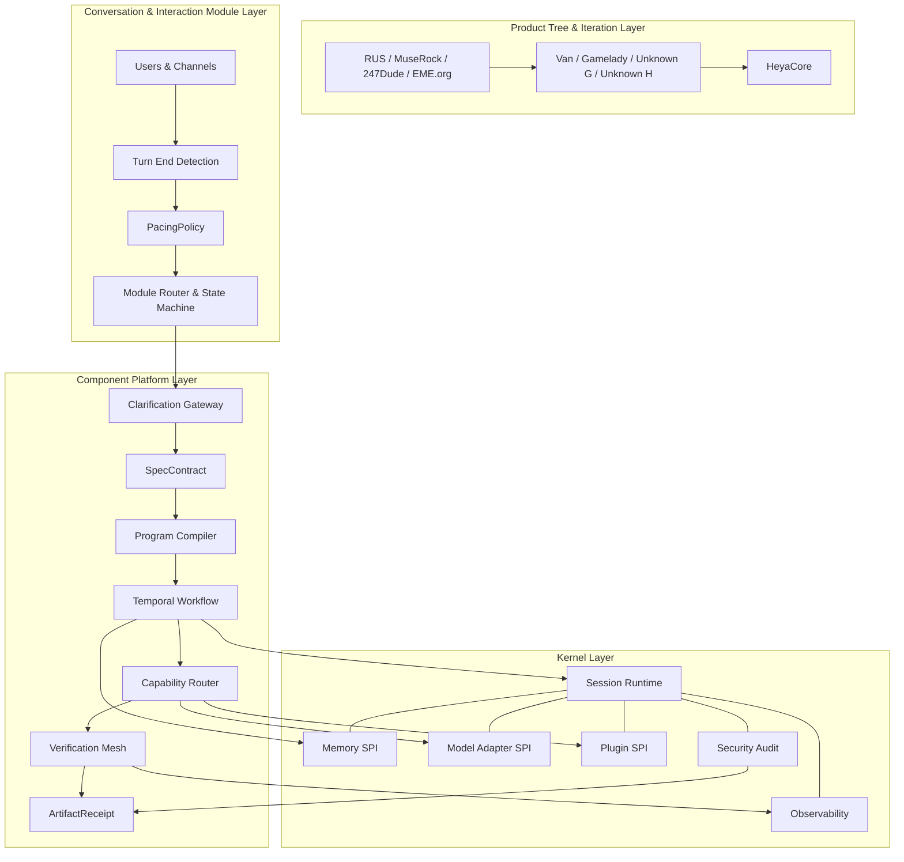
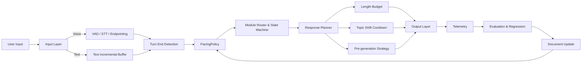
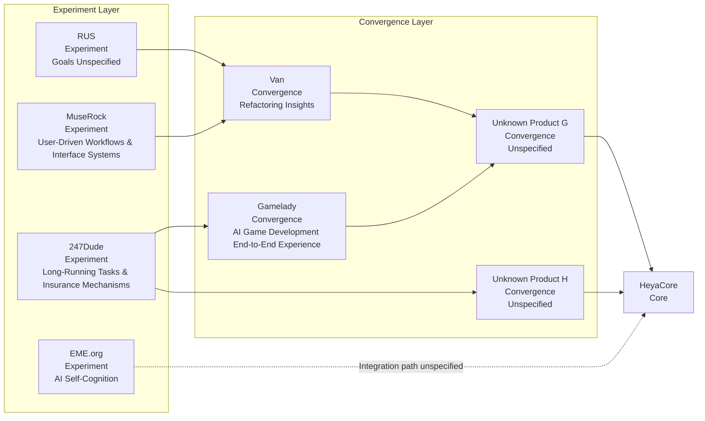

# HeyaCore Product Tree Deep Research Report

## Research Scope and Core Conclusions

This report conducts an integrated analysis **based solely on the four provided documents**, without introducing external factual corrections. Together, the four documents outline a HeyaCore that is not a "chat product backend refactoring" but an organizational-level AI system composed of a **replaceable kernel, long-term workflow platform, modular conversation rhythm layer, and product tree iteration layer**: the first document positions it as an embeddable, replaceable, orchestrable, and auditable headless AI engine; the second grounds it as a software factory centered on spec contracts, workflows, and verifiable artifacts; the third requires extracting conversation rhythm from prompts and upgrading it to an independent `PacingPolicy`; the fourth explicitly states that the final product will not be completed in one pass but will gradually accumulate capabilities through sub-product trees and ultimately converge into HeyaCore.

The core judgment synthesized from all four documents is: **HeyaCore's success or failure does not depend on any single model's performance, but on whether boundaries are defined clearly before product expansion.** If the unified SPI, workflow atomic objects, rhythm contracts, and audit/observability chains are locked in first, and different sub-products then provide "validated experience" for these shared foundations, the product tree approach is viable; conversely, if sub-products each grow their own interfaces, state models, and behavioral policies, the result will be "capability silos" where experience cannot be consolidated, capabilities cannot be reused, and integration costs escalate sharply. This judgment simultaneously draws from the first document's emphasis on SPI and replaceable boundaries, the second document's typed requirements for `CapabilityManifest / SpecContract / WorkOrder / ArtifactReceipt`, the third document's advocacy for `PacingPolicy` as a first-class object, and the fourth document's roadmap of "build sub-products first, then converge to HeyaCore."

The table below lists the key gaps that are **explicitly unspecified** in the current documents and that will affect implementation strategy. These gaps will not block architecture design but will directly impact the product tree's integration efficiency and priority ordering.

| Item | Document Status | Impact on Implementation |
|---|---|---|
| Goals and capability boundaries of `Unknown Products G / H` | Unspecified | Cannot determine whether they are "capability convergence layers" or new capability forks |
| Integration path for `EME.org` with the main line | Unspecified | Whether its experience can flow back to HeyaCore remains unclear |
| **Exit criteria** for each sub-product in the product tree | Unspecified | Experience may remain at the product layer rather than consolidating as shared capabilities |
| Final UI details, SLA, budget caps, deployment boundaries | Explicitly marked as unspecified | Platform layer must adopt platform-agnostic, late-bound policy design |
| Unified rhythm benchmark across voice/text/task | Documents explicitly acknowledge this is still missing | Rhythm layer must allow per-scenario evaluation; forcing a single overall score is inadvisable |
| Timing for unified tech stack and unified contract adoption across sub-products | Unspecified | This is the product tree approach's greatest integration risk |

## Four-Layer Architecture Overview

The "four-layer architecture" below **is not a layer diagram reproduced verbatim from any single document** but a systematic integration of all four: the first document's six-layer headless engine is collapsed into the "kernel layer," the second document's software factory into the "component platform layer," the third document forms the "conversation and interaction module layer," and the fourth document forms the "product tree and iteration layer." The value of this integration is that it separates the four questions of "capability foundation," "execution system," "behavioral policy," and "product iteration" for independent governance, then connects them through unified contracts.

The complete chain corresponding to this diagram can be summarized as: user input first passes through turn end detection and `PacingPolicy`, then enters the clarification gateway to form a `SpecContract`, which is subsequently decomposed by the program compiler into `Program -> Epic -> WorkOrder -> Operation` and driven by Temporal for execution; during execution, the kernel layer's memory, model, plugin, and security capabilities are uniformly invoked, ultimately consolidating into `ArtifactReceipt`, audit records, and observability data. The product tree layer's role is not to bypass this chain but to continuously provide reusable capabilities and validation scenarios for it.

| Layer | Functional Positioning | Core Design Principles | Explicit Technologies or Contracts | Unspecified Parts | Relationships and Data/Event Flows with Other Layers |
|---|---|---|---|---|---|
| Kernel Layer | Provides an embeddable, replaceable, auditable shared runtime | All external dependencies accessed via SPI; all internal actions recorded via event streams; schema-centric rather than SDK-centric | `Session Runtime`, `Memory SPI`, `Model Adapter SPI`, `Plugin Runtime`, `Security & Observability`; reference stack is TypeScript/Node, PostgreSQL, Redis, Qdrant; object contracts lean toward `OpenAPI + JSON Schema + AsyncAPI` | Final service decomposition granularity, specific message bus implementation, and plugin marketplace mechanism not fully fixed | Provides tenant, session, memory, model, plugin, security, and observability capabilities to the platform layer; outputs key context such as `trace_id / run_id / tenant_id / policy_set` |
| Component Platform Layer | Transforms vague requirements into executable, verifiable, rollbackable engineering pipelines | Workflows as system source of truth; contracts as module boundaries; artifacts not text as delivery units | `SpecContract`, `CapabilityManifest`, `WorkOrder`, `ArtifactReceipt`; Temporal, gRPC/Protobuf, NATS JetStream, Firecracker/gVisor/WASI, OpenFGA/OPA/Vault/SPIRE, OTel, Bazel, Argo CD | Final choice of cloud-first, local-first, or hybrid deployment undecided; budget cap undecided | Consumes kernel layer SPI; receives input from conversation layer; generates `workflow_id / artifact_digest / verification result / audit log` |
| Conversation & Interaction Module Layer | Controls turn end, response speed, segment length, topic shift pace, and interruption behavior | Rhythm extracted from prompts, upgraded to `PacingPolicy` as a first-class object; rhythm must be observable, regressionable, and A/B-testable | `turn_mode`, `latency_budget`, `response_budget`, `interruption_policy`, `topic_shift_policy`, `memory_policy`, `telemetry`, `eval_cases` | Unified cross-scenario benchmark not yet formed; specific all-product unified integration framework not fixed | Serves as the behavioral governance layer before user input enters the platform; writes back telemetry such as `user_turn_end_ms / assistant_start_ms / topic_shift_flag` to the platform and kernel layers |
| Product Tree & Iteration Layer | Gradually accumulates experience through sub-products and converges into HeyaCore | Does not directly build the final product; experiments with capabilities first, then validates convergence, finally converging to the core framework | Confirmed nodes include RUS, MuseRock, 247Dude, EME.org, Van, Gamelady, Unknown G, Unknown H, HeyaCore; RUS and MuseRock have begun development | Multiple product goals still unspecified; feedback mechanism unspecified; EME.org path unspecified | Ideally, sub-product experience should flow down as shared `CapabilityManifest / PacingPolicy / WorkOrder templates / test suites`, then drive HeyaCore convergence upward |

The basis for this layering table comes respectively from: the first document's definition of headless engine, SPI boundaries, unified schemas, and replaceable technology foundations; the second document's definitions of contract objects, long-term workflows, verification meshes, and artifact delivery; the third document's definitions of `PacingPolicy`, module document templates, and rhythm telemetry; and the fourth document's definition of product tree evolution relationships.

## Core Technology Deep Analysis

### Kernel Boundaries and Replacement Strategy

The most important conclusion from the first document is not which database or model provider it recommends, but converging HeyaCore's stable boundaries to three primary SPIs: `Memory SPI`, `Model Adapter SPI`, and `Plugin SPI`. This means HeyaCore must first define "what is a memory item," "what is a model invocation canonical request," and "what is a plugin capability declaration" before connecting to specific backends; otherwise, any currently effective implementation will become a lock-in point during future product tree convergence.

| SPI | Responsibility Boundary | Document's Replacement Strategy | Impact on Other Layers |
|---|---|---|---|
| Memory SPI | Only manages memory read/write, layering, consistency, TTL, namespaces, and retrieval; does not expose underlying database details | Switching via `QdrantAdapter / PostgresPgvectorAdapter / RedisHotMemoryAdapter`; memory divided into `working / episodic / semantic / artifact` four tiers | Platform layer can uniformly abstract project memory, conversation memory, and artifact memory; experience written by different product tree products has the opportunity to be standardized and reused |
| Model Adapter SPI | Handles compilation from canonical request to provider wire format and capability indexing; does not directly carry business rules | Supports `OpenAI Responses / Chat Completions / Anthropic Messages / OpenAI-compatible / Local-compatible` and other interface types; manages differences via capability maps | Platform layer's model routing and policy evaluation can evolve independently; workflow layer does not need rewriting when any provider's interface changes |
| Plugin SPI | Handles tool exposure, invocation, permissions, and sandbox descriptions; does not hardcode tool capabilities in application logic | Compatible with internal tools, HTTP tools, and MCP bridge; forms unified declarations via `plugin_id / capabilities / sandbox_profile` | Platform layer can package any sub-product's experimental capabilities as shared tools, then incorporate them into approval, observability, and audit |
| Security & Audit Plane | Strictly speaking not an SPI, but at the same level as core runtime in the documents | Forms a unified governance plane through `policy_evaluate`, `security.blocked`, `secret.accessed`, namespace isolation, audit logs, and traces | If this layer is deferred, multi-tenant isolation, deletion semantics, supply chain trustworthiness, and cross-product audit will all destabilize |

The table above is an integrated abstraction of the first and second documents: the first document defines SPI and kernel object boundaries; the second document further embeds permissions, identity, sandbox, artifact signing, and workflow routing into the platform execution chain, forming a complete cross-section of kernel and platform.

For multi-LLM scheduling, the first document has already provided five stable strategies: `serial`, `parallel`, `vote`, `expert_route`, and `hybrid`. `serial` corresponds to routine low-cost Q&A; `parallel` corresponds to latency-sensitive or early-stop parallel racing; `vote` corresponds to high-risk conclusion consensus; `expert_route` corresponds to domain-based professional routing by task type; `hybrid` corresponds to the mixed approach of "cheap model triage first, then upgrade high-risk samples." The document also explicitly states that routing decisions should not only consider model performance but simultaneously factor in cost, latency, privacy, and auditability.

> **High-Risk Point**: If model routing first grows independently within sub-products and then attempts to converge to HeyaCore, the result will be each product having its own provider contract, fallback rules, and price card, making it extremely difficult for the platform layer to unify metering and replacement. The first document has explicitly listed "premature binding to a single database, single API format, or single workflow framework" as a core risk.

Security, privacy, audit, and multi-tenant isolation are defined as **first-class citizens** in both technical documents, not pre-launch patches. The first document emphasizes that the risk focus is prompt injection, unauthorized tool invocation, sensitive information disclosure, model abuse, supply chain issues, and namespace-based multi-tenant isolation with deletable memory semantics; the second document implements these requirements as OpenFGA, OPA, Vault, SPIRE, Firecracker/gVisor/WASI, audit ledgers, ArtifactReceipt, and GitOps release gates. Taken together, HeyaCore's security chain should run from "input classification and policy evaluation" all the way through "sandbox execution, verification mesh, artifact signing, and rollback audit."

### Long-Running Tasks and Workflows

The second document defines HeyaCore as an "AI software factory centered on workflows, bounded by typed contracts, and delivering verifiable artifacts," and establishes Temporal as the durable execution foundation for long-running tasks and fault recovery. This determines that long-term projects are not "multi-turn conversations stretched longer" but require making clarification, planning, execution, verification, audit, and rollback into a single persistent chain.

| Layer | Primary Object | Role | Persistence and Failure Recovery |
|---|---|---|---|
| Program | Top-level project goal, e.g., "build an entirely new game engine" | Carries project-level goals, quality thresholds, and staged deliverables | Driven by `SpecContract` and program compiler; serves as the long-term planning mainline |
| Epic | A major subsystem thread, e.g., rendering, physics, resource system | Forms medium-term manageable capability blocks | Can be locally replanned after failure without restarting the entire Program |
| WorkOrder | Completable and testable engineering slice with goals not exceeding several days | Becomes the platform's basic execution and verification unit | Each WorkOrder has an independent branch, sandbox, and verification context; retryable, isolatable, and human-approvable |
| Operation | A single specific action, e.g., compile, test, route, release | Interfaces with tool and capability invocation | Recorded by workflow event history; idempotently retryable; compensatable or rollbackable after failure |

This `Program -> Epic -> WorkOrder -> Operation` layering is not purely management terminology but the design basis for the platform's minimum execution granularity. The second document also explicitly requires "one WorkOrder, one isolated workspace" and creates a `MergeCoordinationWorkflow` in conflict scenarios, demonstrating that the platform has incorporated parallel development, conflict prediction, regression verification, and human approval from long-term engineering into the main process.

The true closed loop of long-running workflows comes from the four atomic objects defined in the second document: `SpecContract` is responsible for converging requirements into knowns, unknowns, assumptions, and acceptance criteria; `CapabilityManifest` is responsible for declaring invocable capabilities; `WorkOrder` is responsible for executing tasks and binding acceptance criteria; `ArtifactReceipt` is responsible for archiving code, model calls, verification results, and signatures as auditable artifacts. In other words, HeyaCore does not let the model "complete tasks" but makes the system automatically generate plans, execute, verify, gate, and roll back around these atomic objects.

Looking at the first and second documents together, the state persistence of long-running tasks is not just one layer of Temporal event history. It should also include at minimum: session and routing state, layered memory, verification records, build artifact identity, release status, observability metrics, and policy evaluation results. This is precisely why the second document simultaneously introduces Postgres, pgvector, OpenSearch, object storage, Redis, OTel, and ArtifactReceipt, while the first document defines `trace_id / run_id / cost / latency / security events` as kernel-level events.

> **High-Risk Point**: If long-running workflows only save "conversation records" without saving `SpecContract`, `WorkOrder`, verification results, `ArtifactReceipt`, and the audit chain, they cannot support the document's requirements for "actual delivery," "rollbackable failure," and "accountability for complex projects." The second document has explicitly stated that relying on Git alone to roll back code is insufficient to recover artifacts, policies, and verification state.

### Conversation Rhythm Control and CI Integration

The most critical contribution of the third document is abstracting the "conversation experience issue" that is easily mixed into prompts into a configurable, measurable, and regression-testable `PacingPolicy`. This means the conversation layer is no longer about "writing a more conversational prompt" but about explicitly managing turn end, response latency, segment length, topic shift, interruptions, and memory compression.

| Rhythm Dimension | Contract Fields in Document | Reproducible Metrics | Recommended CI/CD Integration |
|---|---|---|---|
| Turn end | `turn_mode`, can be `manual / vad / semantic / hybrid` | End-of-turn latency; optionally combined with `SHIFT/HOLD F1` | Offline replay with timestamped turn logs; online simulated A/B comparing `server_vad` vs. `semantic` |
| Response latency | `latency_budget`, typically expressed as `p50_target_ms / p95_target_ms` | Response latency, TTFT, subjective wait perception | Connect `user_turn_end_ms` and `assistant_start_ms` to telemetry and set gates |
| Segment length | `response_budget`, including `min_words / max_words / max_sentences` | Length adherence, length error | Verify length error in regression tests and include chat module output length in gates |
| Topic shift | `topic_shift_policy`, including `cooldown_turns / allowed_targets / repair_flow` | Topic-shift F1, topic_shift_rate | Dedicated topic-shift case replay; require modules to declare allowed topic targets |
| Takeover / interruption | `interruption_policy`, including `allow_barge_in / resume_false_interruption / backchannel_ignore` | Takeover Rate, False interruption rate | Compare interruption and false interruption ratios in small-traffic A/B |
| Long conversation compression | `memory_policy`, including `history_limit / summary_trigger / truncate_rule` | Summary trigger accuracy, context fidelity, long conversation stability | Include long conversation replay and pre/post-summary result differences in nightly regression |

This table directly corresponds to the `PacingPolicy` template, minimal code examples, recommended metrics, and three-step engineering migration in the third document. The third document also explicitly states that rhythm optimization experiments should be divided into at least three layers: offline replay, online simulation, and real small-traffic A/B; and that document updates can be achieved through GitHub Actions periodically pulling new materials, enabling "documentation and regression to evolve together."

For HeyaCore, this layer has a very critical engineering implication: **the rhythm layer should not be attached to any specific product.** Whether the final product is MuseRock, Van, Gamelady, or the HeyaCore main product, as long as there is an interaction process of "user input -- system response -- state transition," the same `PacingPolicy`, the same core telemetry fields, and the same regression harness should be applicable. Otherwise, the product tree will reinvent the wheel at the "behavioral experience" layer.

The third document also reminds of two practical constraints that must be maintained: first, **there is currently no unified rhythm benchmark across voice/text/task**; second, Chinese-language original research and public industrial implementations remain relatively scarce. Therefore, HeyaCore's more prudent strategy at this layer is not to first define a global overall score but to first establish unified contracts, logs, and regression processes, then converge thresholds by product scenario.

## Product Tree Approach Evaluation

The fourth document explicitly states: HeyaCore will not be developed directly from the start but will follow a "product tree iteration" approach, gradually accumulating experience through different sub-products before converging into the final framework. Nodes and directions already appearing in the graph include: `RUS -> Van`, `MuseRock -> Van`, `247Dude -> Gamelady`, `Van -> Unknown G`, `Gamelady -> Unknown G`, `247Dude -> Unknown H`, `Unknown G / H -> HeyaCore`; there is also an `EME.org` node, but the document has not yet described its connection to the main path. The document also notes that RUS and MuseRock have begun development.

In terms of feasibility, this approach is **not inherently viable but conditionally viable.** It is viable because several sub-product directions in the fourth document are highly complementary to the capability axes in the first three documents: MuseRock corresponds to "user-driven workflows and interface systems," naturally aligning with the second document's `CapabilityManifest`, clarification gateway, and capability routing; 247Dude corresponds to "long-running tasks and insurance mechanisms," naturally aligning with the second document's Temporal, `Program -> Epic -> WorkOrder -> Operation`, and failure recovery; Van's "refactoring insights" fits the insight, planning, and code understanding paths in complex projects; Gamelady's "end-to-end AI game development experience based on Godot" happens to be the complex engineering pilot validation scenario emphasized in the second document. In other words, this product tree is not branching arbitrarily but is organized around four main capability axes: interface systems, long-running tasks, engineering verification, and end-to-end complex scenarios.

The "Experiment Layer / Convergence Layer / Core Layer" labels in the diagram above are this report's **integrated classification** based on the fourth document's product tree relationships, the first document's replaceable kernel thinking, and the second document's convergence-validation platform approach -- they are not the fourth document's original labels. This classification is made because RUS, MuseRock, 247Dude, and EME.org clearly resemble capability exploration nodes; Van, Gamelady, and Unknown G/H more closely resemble convergence nodes that bring multiple capability axes together; and HeyaCore is the core node that will ultimately output a unified framework.

The table below is more suitable for the team to directly use in determining whether each node should continue, converge, or pause.

| Node | Documented Goals | This Report's Classification | Main Contribution to HeyaCore | Greatest Current Uncertainty |
|---|---|---|---|---|
| RUS | Unspecified; only known to exist and flow to Van | Experiment Layer | May provide preliminary insights or methodological capabilities | Both functional boundaries and technical approach unspecified |
| MuseRock | User-driven workflows and interface systems | Experiment Layer | Best suited as a pilot test for shared workflow/interface contracts | Whether it will directly adopt shared contracts is unspecified |
| 247Dude | Long-running tasks and insurance mechanisms | Experiment Layer | Best suited as a validation node for long-running tasks, recovery, and insurance mechanisms | Technical definition of insurance mechanism unspecified |
| Van | Refactoring insights | Convergence Layer | May converge RUS insights and MuseRock's interface systems into code/product refactoring scenarios | Input/output contracts unspecified |
| Gamelady | End-to-end AI game development experience based on Godot | Convergence Layer | Best suited as a productized validation ground for the second document's "complex engineering pilot" | Whether it will be fully based on the shared platform foundation is unspecified |
| EME.org | AI self-cognition | Experiment Layer | May form self-reflective, self-descriptive, or metacognitive capabilities | Completely disconnected from main line; integration path unspecified |
| Unknown Product G | Unspecified | Convergence Layer | Theoretically for converging Van and Gamelady experience | Goals unspecified; risk of duplicate construction |
| Unknown Product H | Unspecified | Convergence Layer | Theoretically for consolidating 247Dude's long-running task capabilities | Goals unspecified; risk of capability gap |
| HeyaCore | Final product, organizational-level AI application framework | Core Layer | Converges shared kernel, platform capabilities, and product experience | Success depends on whether intermediate layers truly consolidate into reusable capabilities |

From a risk perspective, the product tree approach has at least five high-risk points. First, **technology integration risk**: if sub-products each independently decide their own data models, provider contracts, and tool declaration methods, the cost of subsequently unifying to `Memory SPI / Model Adapter SPI / Plugin SPI` will be very high. Second, **interface compatibility risk**: if MuseRock, 247Dude, Van, and Gamelady do not uniformly adopt the shared object set of `CapabilityManifest / SpecContract / WorkOrder / ArtifactReceipt / PacingPolicy`, capabilities will be difficult to migrate between products. Third, **resource dispersion risk**: the fourth document unfolds multiple sub-product nodes at once, while the second document requires investment in platform engineering, SRE, security, and QA, meaning the team can easily be torn between "sub-product demos" and "shared foundation construction." Fourth, **insufficient experience consolidation risk**: the product tree can accumulate "experience" but that does not equal accumulating "capability"; without a unified feedback mechanism, experience will remain in product stories. Fifth, **incomplete topology risk**: the unspecified goals of Unknown G/H and EME.org make the roadmap difficult to converge.

> **Conclusion**: The product tree approach is worth continuing, but the prerequisite is that it must be upgraded from "parallel development of multiple products" to an engineering mechanism of "multiple products sharing the same set of foundational contracts and continuously feeding back." Otherwise, the product tree will produce multiple experience packages, not an increasingly powerful HeyaCore.

## Improvement and Innovation Recommendations

The recommendations below are divided into two categories: one consists of actions already explicitly indicated by the documents but requiring enforcement as hard project constraints; the other consists of **supplementary recommendations based on document gaps**, aimed at enabling the product tree to truly converge to HeyaCore rather than remaining in a state of parallel experimentation indefinitely. All recommendations include priority and verifiability for direct inclusion in project management.

| Recommendation | Priority | Verifiability | Source Status | Basis |
|---|---|---|---|---|
| Shared contracts first: freeze `Memory SPI / Model Adapter SPI / Plugin SPI` and the shared object set of `CapabilityManifest / SpecContract / WorkOrder / ArtifactReceipt / PacingPolicy` before all sub-product expansion | P0 | All active sub-products must output at least one shared contract instance and pass compatibility checks | Direct integration | First document requires SPI first; second document provides four atomic objects; third document requires `PacingPolicy` as a first-class object |
| Establish a "product tree feedback pipeline": each sub-product iteration must deliver not only product features but also **at least one reusable capability package, one set of regression test cases, and one observability definition** | P0 | Periodically measure cross-product reused capability count, regression pass rate, and shared telemetry coverage | Gap-based supplement | Fourth document only has product tree relationships, no experience feedback mechanism; first three documents all emphasize contracts, regression, and observability as shared foundations |
| Redefine `Unknown Products G / H` as **convergence products**, not new greenfield products: their sole objective should be validating "whether two or more capability axes can work on a unified foundation" | P1 | Each convergence product must consume at least two types of shared capabilities and output a unified ArtifactReceipt | Gap-based supplement | Fourth document's graph shows G/H as convergence nodes but goals are unspecified; second document emphasizes intermediate pilots are key to reducing final integration risk |
| Upgrade rhythm governance to a platform capability: establish `PacingPolicy Registry + rhythm regression set + user_turn_end_ms / assistant_start_ms / topic_shift_flag` unified log specification | P1 | Any interaction module must have a rhythm template, at least one regression case, and at least one small-traffic A/B before going live | Direct integration | Third document explicitly provides templates, metrics, three-step migration, and experiment matrix |
| Establish unified deletion semantics and multi-tenant gates: incorporate `hard_delete / soft_delete+tombstone / rebuild_embedding / revoke_cache / log_retention_expiry` as standard platform actions | P1 | `cross-tenant leak = 0` in security tests; deletion use cases complete multi-layer closed-loop verification | Direct integration | First document has listed deletion semantics closure and namespace isolation as architectural requirements; second document implements them in the permissions and audit system |
| Designate EME.org as an exploration branch; only allow it to enter the main convergence path when it can output explicit shared capability interfaces | P2 | Must complete four definitions -- input, output, reusable objects, and risk boundaries -- before connecting to the main line | Gap-based supplement | Fourth document only provides a node without an integration path; prematurely including it in the main line would increase integration uncertainty |

The core of these recommendations is not "build more middleware platforms" but to transform the shared boundaries already clearly defined in the first three documents into **entry tickets and graduation criteria** for the fourth document's product tree. In other words, sub-products no longer prove their value by "producing a demo" but by "what new capability, regression, and metric they have added to the shared foundation."

## Implementation Path and Execution Priority

Combining the first document's kernel milestones, the second document's platform construction roadmap, the third document's rhythm migration steps, and the fourth document's existing product tree relationships, the most prudent implementation order is not "advancing all sub-products in parallel" but progressing in the sequence of **shared foundation -> two core capability axes -> convergence validation -> HeyaCore convergence**. This both aligns with the worldview document's "build sub-products first" thinking and satisfies the technical documents' "define contracts first, then implement" requirement.

| Phase | Primary Objective | Recommended Priority Targets | Exit Criteria |
|---|---|---|---|
| Shared foundation freeze | Lock shared objects and minimum reference stack | Kernel layer + Platform layer | `Memory SPI / Model Adapter SPI / Plugin SPI`, `CapabilityManifest / SpecContract / WorkOrder / ArtifactReceipt / PacingPolicy` complete first stable version |
| Capability experimentation phase | Prioritize validating the two most universally applicable capability axes | MuseRock, 247Dude | MuseRock can output reusable workflow/interface contracts; 247Dude can run through long-running tasks, failure recovery, and insurance mechanisms |
| Behavioral governance integration | Upgrade rhythm from prompt tuning to unified module contracts | All existing interactive products | Every interaction module has `PacingPolicy`, core telemetry fields, and at least one regression set |
| Convergence validation phase | Validate whether the shared foundation holds using real complex scenarios | Van, Gamelady | Van reuses at least two types of shared capabilities; Gamelady passes an end-to-end complex engineering closed loop on the unified platform |
| Convergence phase | Converge results into HeyaCore Alpha | Advance only after Unknown G/H are clarified | At least two convergence products run on the same set of core contracts and observability chains, with multi-tenant, security, and rollback chains initially stable |
| Production phase | Complete governance capabilities required for an organizational-level framework | HeyaCore | Multi-tenant isolation, audit ledger, deletion semantics, artifact signing, deployment topology, and regression baselines enter formal gates |

If priorities are further compressed into a more executable sequence, the recommendation is: **first extract the shared foundation from MuseRock and 247Dude, then do convergence validation with Van and Gamelady, keep EME.org off the main line for now, require Unknown G/H to be defined first, and only then enter HeyaCore's final convergence.** The logic of this sequence is very clear: MuseRock and 247Dude respectively cover the two most foundational capability axes of "workflows/interface systems" and "long-running tasks/insurance mechanisms"; Van and Gamelady are better suited to bear the validation responsibility of "whether capability convergence works"; EME.org should not occupy main-line resources before its integration path is specified.

The final implementable path can be summarized in one sentence: **transform the product tree from "multi-product incubation" to "multiple products training the foundation for HeyaCore" through shared contracts.** As long as the team clearly defines "what shared capability each sub-product must produce," the product tree approach proposed in the fourth document will not be a source of risk but will become HeyaCore's strongest moat -- because it means the final framework was not designed in a vacuum but has been repeatedly validated by real workflows, rhythm control, complex engineering, and end-to-end scenarios across actual products.
