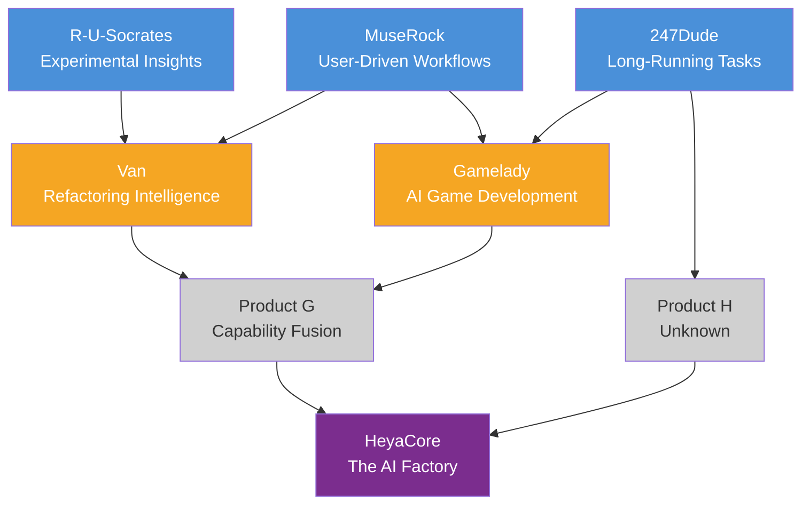
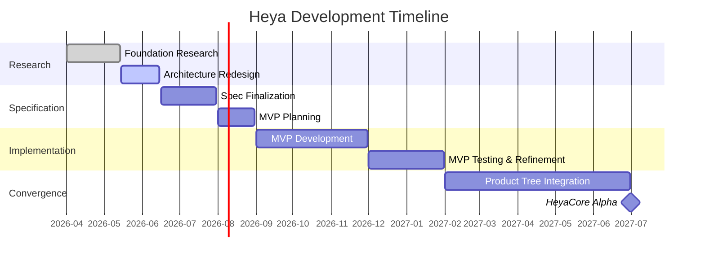

# Heya Roadmap

> This document tracks the research and development progress of the Heya AI Factory.

---

## Product Tree Strategy

Heya is not built directly. Instead, we iterate through a **product tree** — each product validates specific capabilities that eventually converge into HeyaCore.

### Legend
- 🔵 **Blue**: Active development
- 🟡 **Yellow**: Planned
- ⚪ **Gray**: Undefined
- 🟣 **Purple**: Ultimate goal

---

## Research Phases

### Phase 1: Foundation Research ✅

**Status**: Complete

**Deliverables:**
- [x] Core engine architecture analysis
- [x] Componentized AI application architecture study
- [x] Product tree deep research
- [x] Worldview and philosophy definition
- [x] Dialogue pacing control research
- [x] ZeroAgent cross-domain architecture design

**Output**: See [RESEARCH/](./RESEARCH/) for all research documents.

---

### Phase 2: Architecture Redesign 🔄

**Status**: In Progress

**Goal**: Redefine Heya as an "AI Factory" with a human-AI hybrid model.

**Deliverables:**
- [x] Factory metaphor definition
- [x] Core concept document
- [x] System architecture design
- [x] Core contract specifications
- [x] Factory design guide
- [x] API reference
- [x] Vision document
- [ ] Decision records (ADR)
- [ ] Update remaining docs for consistency

**Output**: See [ARCHITECTURE/](./ARCHITECTURE/) for all architecture documents.

---

### Phase 3: Specification Finalization

**Status**: Upcoming

**Goal**: Freeze the specifications that will guide implementation, grounded in academic research.

**Research Foundation**: See [RESEARCH/SYNTHESIS.md](./RESEARCH/SYNTHESIS.md) and [DECISIONS/006](./DECISIONS/006-adopted-design-patterns.md)

**Deliverables:**

**Memory System Specification** (based on MemGPT, CoALA, MemRL)
- [ ] Memory tier protocol: working / episodic / semantic / artifact
- [ ] Virtual context management: what stays in-context vs. retrieved
- [ ] Memory operations: write, query, search, consolidate, forget
- [ ] Stability-plasticity rules: what can change, what requires validation
- [ ] Memory schema (JSON)

**Factory SOP Encoding Format** (based on MetaGPT)
- [ ] Pipeline step definition format (role, input, output, verification)
- [ ] Structured communication protocol between steps
- [ ] Intermediate verification gates
- [ ] Factory template format for common patterns

**Human Checkpoint Protocol** (based on Reflexion, AutoGen)
- [ ] Checkpoint type definitions (design_approval, architecture_decision, critical_output, direction_change, budget_alert)
- [ ] Context packaging: what the human sees at each checkpoint
- [ ] Response handling: approve, modify, reject, defer
- [ ] Feedback storage format (verbal reinforcement learning)

**Verification Pipeline Specification** (based on SWE-agent, MetaGPT)
- [ ] Verification levels 0-4 with concrete criteria for each artifact type
- [ ] Evaluator role definition (separate from generator)
- [ ] Auto-fix policy: when and how AI can fix issues without human input
- [ ] Verification result schema

**Self-Evolution Framework** (based on Self-Evolving Agents Survey, MemRL)
- [ ] Feedback loop: Inputs → Agent → Environment → Optimiser
- [ ] Metacognition signals and response actions
- [ ] Factory evolution triggers and approval process
- [ ] Memory-based learning protocol (no weight updates)

**MVP Scope Definition**
- [ ] Define minimum viable factory capabilities
- [ ] Define minimum viable memory system
- [ ] Define minimum viable verification pipeline
- [ ] Define minimum viable human checkpoint types
- [ ] Technology stack selection for MVP

---

### Phase 4: MVP Implementation Planning

**Status**: Upcoming

**Goal**: Create a detailed implementation plan for the first working prototype.

**Deliverables:**
- [ ] PROJECT_STRUCTURE.md
- [ ] Interface definitions (TypeScript)
- [ ] Database schema
- [ ] API endpoint specifications
- [ ] Test strategy
- [ ] Deployment plan

---

### Phase 5: MVP Development

**Status**: Future

**Goal**: Build the minimum viable Heya Factory.

**Scope** (to be defined in Phase 3):
- Conversational factory design
- Basic WorkOrder execution
- Simple verification (compile + test)
- Project-level memory (PostgreSQL)
- Human checkpoints (at least 2 types)
- Single model provider (OpenAI or Anthropic)

---

## Active Development

| Project | Repository | Status | Focus |
|---------|-----------|--------|-------|
| R-U-Socrates | [github.com/zbbsdsb/R-U-Socrates](https://github.com/zbbsdsb/R-U-Socrates) | Active | Experimental AI insights |
| MuseRock | [github.com/zbbsdsb/MuseRock](https://github.com/zbbsdsb/MuseRock) | Active | User-driven workflows |

---

## Key Decisions

See [DECISIONS/](./DECISIONS/) for the full decision log.

| # | Decision | Date | Status |
|---|----------|------|--------|
| 001 | Heya is an AI Factory | 2026-05-15 | Accepted |
| 002 | AI is the factory (not a tool inside it) | 2026-05-15 | Accepted |
| 003 | Human-AI hybrid execution model | 2026-05-15 | Accepted |
| 004 | Intent-driven factory design | 2026-05-15 | Accepted |
| 005 | Universal product scope | 2026-05-15 | Accepted |

---

## Milestones

